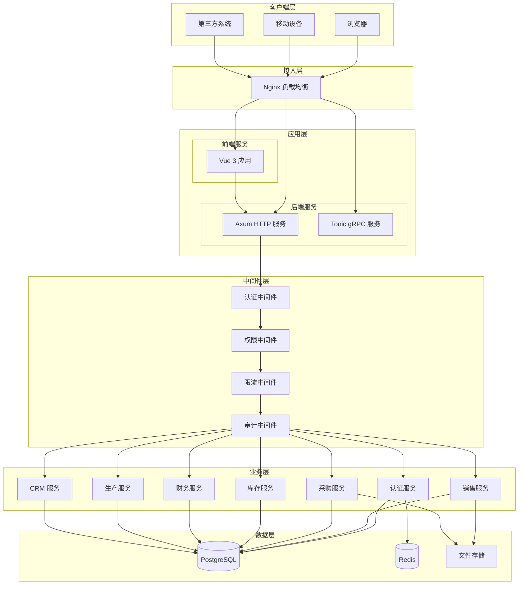
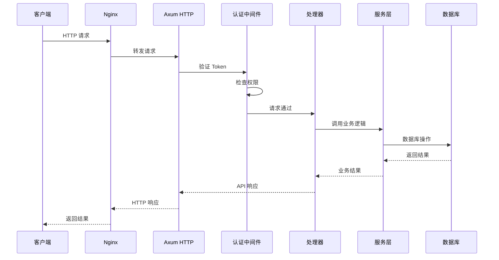
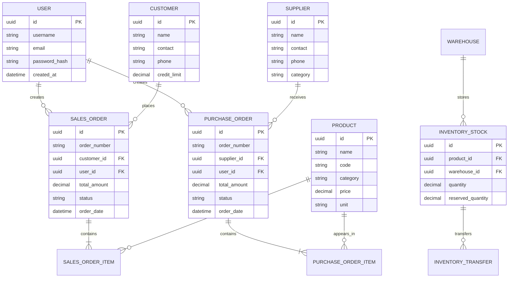

# 冰溪 ERP 系统架构文档

## 概述

冰溪 ERP 是一个面向面料纺织行业的现代化企业资源计划系统，集成了采购、销售、库存、生产、财务、CRM 等核心业务模块，并引入 AI 智能分析能力。系统采用前后端分离架构，后端使用 Rust + Axum 构建高性能 REST/gRPC 双协议服务，前端使用 Vue 3 + Element Plus 构建响应式管理界面。系统支持多租户 SaaS 部署模式，具备完整的权限管理、审计日志和工作流引擎。

## 技术栈

### 后端

**语言与运行时**
- Rust 1.75+
- Tokio 异步运行时

**框架**
- Axum 0.7 - HTTP 框架
- Tonic 0.12 - gRPC 框架
- SeaORM 1.0 - ORM 框架

**数据存储**
- PostgreSQL 15+ / MySQL 8.0+ - 主数据库
- Redis 7.0+ - 缓存和限流
- 文件存储 - 本地文件系统

**基础设施**
- Docker + Docker Compose - 容器化
- GitHub Actions - CI/CD
- Prometheus + Grafana - 监控
- Tracing + Loki - 日志

**外部服务**
- SMTP 邮件服务
- AI 分析服务
- 第三方支付接口

### 前端

**框架**
- Vue 3.4+ (Composition API)
- Vite 5.0+ - 构建工具
- TypeScript 5.4+

**UI 组件**
- Element Plus 2.4+
- ECharts 5.4+ - 图表库

**状态管理**
- Pinia 2.1+

**HTTP 客户端**
- Axios 1.6+

## 项目结构

```
workspace/
├── backend/                 # Rust 后端
│   ├── src/
│   │   ├── main.rs         # 主入口
│   │   ├── lib.rs          # 库入口
│   │   ├── config/         # 配置模块
│   │   ├── database/       # 数据库连接池
│   │   ├── grpc/           # gRPC 服务实现
│   │   ├── handlers/       # HTTP 处理器 (102 个文件)
│   │   ├── middleware/      # 中间件 (17 个文件)
│   │   ├── models/         # 数据模型 (158 个文件)
│   │   ├── routes/         # 路由配置
│   │   ├── services/       # 业务服务层 (101 个文件)
│   │   ├── utils/          # 工具模块
│   │   └── bin/            # 二进制工具
│   ├── migrations/         # 数据库迁移
│   ├── tests/              # 测试
│   └── Cargo.toml
├── frontend/               # Vue 前端
│   ├── src/
│   │   ├── api/           # API 调用层 (85 个文件)
│   │   ├── components/    # 通用组件
│   │   ├── router/        # 路由配置
│   │   ├── store/         # 状态管理
│   │   ├── views/         # 页面组件 (60 个目录)
│   │   └── utils/         # 工具函数
│   ├── tests/             # 测试
│   └── package.json
├── deploy/                 # 部署配置
├── monitoring/             # 监控配置
└── docs/                  # 项目文档
```

**入口点**
- `backend/src/main.rs` - 后端服务入口，同时启动 HTTP 和 gRPC 服务
- `frontend/src/main.ts` - 前端应用入口
- `backend/src/bin/cli.rs` - CLI 运维工具

## 子系统

### 1. 认证授权子系统
**目的**: 处理用户认证、授权和权限管理
**位置**: `backend/src/services/auth_service.rs`, `backend/src/middleware/auth.rs`
**关键文件**: `auth_handler.rs`, `user_service.rs`, `role.rs`
**依赖**: JWT 库、Redis、数据库
**被依赖**: 所有需要认证的 API 端点

### 2. 业务逻辑子系统
**目的**: 实现核心业务逻辑，包括采购、销售、库存、生产等
**位置**: `backend/src/services/` (101 个服务文件)
**关键文件**: `sales_order_service.rs`, `purchase_order_service.rs`, `inventory_service.rs`
**依赖**: 数据模型、数据库、事件总线
**被依赖**: HTTP 处理器、gRPC 服务

### 3. 数据访问子系统
**目的**: 管理数据库连接、ORM 映射和数据迁移
**位置**: `backend/src/models/` (158 个模型文件), `backend/src/database/`
**关键文件**: `sea-orm` 实体定义、迁移文件
**依赖**: SeaORM、PostgreSQL/MySQL
**被依赖**: 业务逻辑子系统

### 4. API 网关子系统
**目的**: 处理 HTTP 请求路由、中间件链和响应处理
**位置**: `backend/src/handlers/`, `backend/src/routes/`, `backend/src/middleware/`
**关键文件**: `routes/mod.rs` (1350 行路由定义)
**依赖**: Axum、Tower 中间件
**被依赖**: 前端客户端、第三方集成

### 5. 前端展示子系统
**目的**: 提供用户界面和交互体验
**位置**: `frontend/src/views/` (60 个页面目录)
**关键文件**: `MainLayout.vue`, `Login.vue`, `Dashboard.vue`
**依赖**: Vue 3、Element Plus、Pinia
**被依赖**: 最终用户

### 6. 事件通知子系统
**目的**: 处理系统内部事件和外部通知
**位置**: `backend/src/services/event_bus.rs`, `backend/src/services/event_notification_service.rs`
**关键文件**: `email_service.rs`, `notification.rs`
**依赖**: 事件总线、邮件服务
**被依赖**: 业务逻辑子系统

## 图表

### 系统架构图



### 请求处理流程



### 数据库 ER 图（核心模块）



## 关键架构特点

1. **双协议服务**: 同时提供 REST API 和 gRPC 接口，满足不同客户端需求
2. **初始化模式**: 数据库不可用时自动降级为初始化向导模式
3. **安全纵深防御**: JWT + Cookie 双认证、CSRF、限流、安全头、审计日志、字段级权限
4. **面料行业专属**: 五维管理（产品/批次/色号/缸号/等级）、双计量单位（米/公斤）、缸号管理、坯布管理
5. **完整 ERP 模块**: 覆盖销售、采购、库存、财务、生产、CRM、BPM 审批、预算、固定资产、多租户 SaaS
6. **事件驱动架构**: 内置事件总线和事件通知服务
7. **DI 容器**: 自定义依赖注入容器
8. **Swagger UI**: 自动 API 文档生成（utoipa）
9. **CLI 运维工具**: 支持服务管理、备份恢复、系统升级