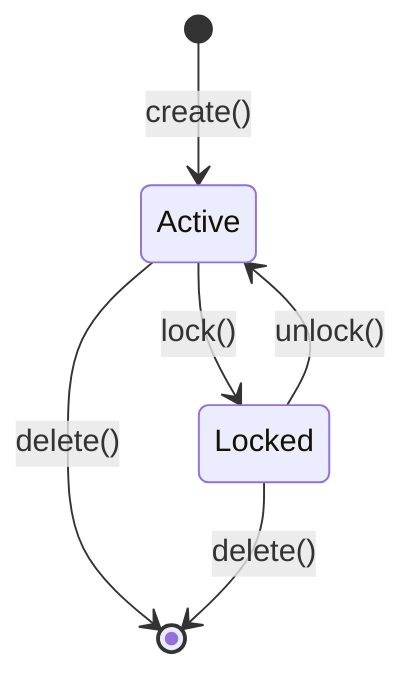
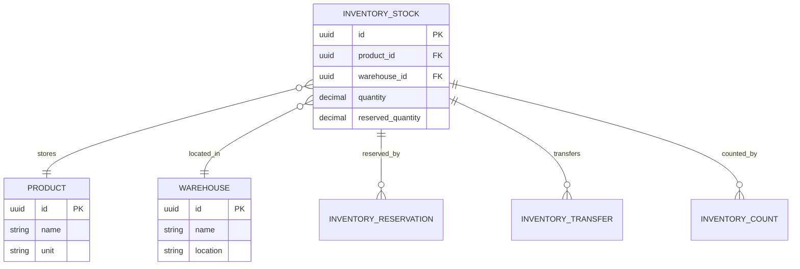

# 库存 (Inventory)

库存是冰溪 ERP 系统中的核心业务实体，代表企业存储的产品数量。库存管理包括库存查询、调拨、盘点、调整、预留等功能，是连接采购、销售、生产的重要纽带。

## 什么是库存？

库存记录了企业各个仓库中产品的实际数量。库存管理确保产品数量的准确性，支持销售发货、采购入库、生产领料等业务操作。库存数据是企业决策的重要依据。

**关键特征**:
- 多仓库管理
- 批次追踪
- 库存预留
- 安全库存预警
- 库存盘点和调整

## 代码位置

| 方面 | 位置 |
|------|------|
| 模型/类型 | `backend/src/models/inventory_stock.rs` |
| 服务 | `backend/src/services/inventory_service.rs` |
| API 路由 | `/api/v1/erp/inventory` |
| 处理器 | `backend/src/handlers/inventory_handler.rs` |
| 数据库 | `inventory_stocks` 表 |
| 测试 | `backend/tests/test_inventory_count.rs` |

## 结构

```rust
#[derive(Clone, Debug, PartialEq, DeriveEntityModel)]
#[sea_orm(table_name = "inventory_stocks")]
pub struct Model {
    #[sea_orm(primary_key)]
    pub id: Uuid,
    pub product_id: Uuid,
    pub warehouse_id: Uuid,
    pub batch_number: Option<String>,
    pub quantity: Decimal,
    pub reserved_quantity: Decimal,
    pub available_quantity: Decimal,
    pub unit: String,
    pub location: Option<String>,
    pub status: String,
    pub tenant_id: Option<Uuid>,
    pub created_at: DateTimeWithTimeZone,
    pub updated_at: DateTimeWithTimeZone,
}
```

### 关键字段

| 字段 | 类型 | 描述 | 约束 |
|------|------|------|------|
| `id` | `Uuid` | 唯一标识 | UUID，不可变 |
| `product_id` | `Uuid` | 产品 ID | 必填，关联产品表 |
| `warehouse_id` | `Uuid` | 仓库 ID | 必填，关联仓库表 |
| `batch_number` | `Option<String>` | 批次号 | 可选，批次管理 |
| `quantity` | `Decimal` | 实际数量 | 必填，大于等于 0 |
| `reserved_quantity` | `Decimal` | 预留数量 | 必填，大于等于 0 |
| `available_quantity` | `Decimal` | 可用数量 | 计算字段：quantity - reserved_quantity |
| `unit` | `String` | 计量单位 | 必填，与产品单位一致 |
| `location` | `Option<String>` | 库位 | 可选 |
| `status` | `String` | 库存状态 | active, locked |

## 不变量

这些规则对有效的库存必须始终成立：

1. **数量非负**: 实际数量不能为负数
   - 示例："库存数量不能为 -10"

2. **预留数量有效性**: 预留数量不能大于实际数量
   - 示例："预留数量 100 不能大于实际数量 50"

3. **可用数量计算**: 可用数量 = 实际数量 - 预留数量
   - 示例："可用数量必须等于实际数量减去预留数量"

4. **单位一致性**: 库存单位必须与产品单位一致
   - 示例："产品单位是米，库存单位不能是公斤"

## 库存状态



### 状态描述

| 状态 | 描述 | 允许的转换 |
|------|------|-----------|
| `active` | 正常状态，可进行出入库操作 | → locked |
| `locked` | 锁定状态，禁止出入库操作 | → active |
| `deleted` | 已删除（软删除） | （终态） |

## 关系



| 关联概念 | 关系 | 描述 |
|---------|------|------|
| 产品 (Product) | 多对一 | 每个库存记录属于一个产品 |
| 仓库 (Warehouse) | 多对一 | 每个库存记录位于一个仓库 |
| 库存预留 (InventoryReservation) | 一对多 | 库存可以被多个订单预留 |
| 库存调拨 (InventoryTransfer) | 一对多 | 库存可以在仓库间调拨 |
| 库存盘点 (InventoryCount) | 一对多 | 库存可以多次盘点 |

## 库存操作

### 入库操作

```rust
pub async fn add_stock(
    db: &DatabaseConnection,
    product_id: Uuid,
    warehouse_id: Uuid,
    quantity: Decimal,
    batch_number: Option<String>,
) -> Result<InventoryStock, AppError> {
    // 查找现有库存记录
    let existing = InventoryStock::find()
        .filter(inventory_stock::Column::ProductId.eq(product_id))
        .filter(inventory_stock::Column::WarehouseId.eq(warehouse_id))
        .filter(inventory_stock::Column::BatchNumber.eq(batch_number.clone()))
        .one(db)
        .await?;
    
    match existing {
        Some(stock) => {
            // 更新现有记录
            let mut active_model: inventory_stock::ActiveModel = stock.into();
            active_model.quantity = Set(stock.quantity + quantity);
            active_model.available_quantity = Set(stock.available_quantity + quantity);
            Ok(active_model.update(db).await?)
        }
        None => {
            // 创建新记录
            let new_stock = inventory_stock::ActiveModel {
                product_id: Set(product_id),
                warehouse_id: Set(warehouse_id),
                batch_number: Set(batch_number),
                quantity: Set(quantity),
                reserved_quantity: Set(Decimal::ZERO),
                available_quantity: Set(quantity),
                unit: Set(get_product_unit(db, product_id).await?),
                status: Set("active".to_string()),
                ..Default::default()
            };
            Ok(new_stock.insert(db).await?)
        }
    }
}
```

### 出库操作

```rust
pub async fn reduce_stock(
    db: &DatabaseConnection,
    product_id: Uuid,
    warehouse_id: Uuid,
    quantity: Decimal,
    batch_number: Option<String>,
) -> Result<(), AppError> {
    let stock = InventoryStock::find()
        .filter(inventory_stock::Column::ProductId.eq(product_id))
        .filter(inventory_stock::Column::WarehouseId.eq(warehouse_id))
        .filter(inventory_stock::Column::BatchNumber.eq(batch_number))
        .one(db)
        .await?
        .ok_or(AppError::StockNotFound)?;
    
    if stock.available_quantity < quantity {
        return Err(AppError::InsufficientStock);
    }
    
    let mut active_model: inventory_stock::ActiveModel = stock.into();
    active_model.quantity = Set(stock.quantity - quantity);
    active_model.available_quantity = Set(stock.available_quantity - quantity);
    active_model.update(db).await?;
    
    Ok(())
}
```

### 库存预留

```rust
pub async fn reserve_stock(
    db: &DatabaseConnection,
    order_id: Uuid,
    items: Vec<ReserveItem>,
) -> Result<(), AppError> {
    for item in items {
        let stock = InventoryStock::find()
            .filter(inventory_stock::Column::ProductId.eq(item.product_id))
            .filter(inventory_stock::Column::WarehouseId.eq(item.warehouse_id))
            .one(db)
            .await?
            .ok_or(AppError::StockNotFound)?;
        
        if stock.available_quantity < item.quantity {
            return Err(AppError::InsufficientStock);
        }
        
        // 更新预留数量
        let mut active_model: inventory_stock::ActiveModel = stock.into();
        active_model.reserved_quantity = Set(stock.reserved_quantity + item.quantity);
        active_model.available_quantity = Set(stock.available_quantity - item.quantity);
        active_model.update(db).await?;
        
        // 创建预留记录
        InventoryReservation::create(db, order_id, item).await?;
    }
    
    Ok(())
}
```

## 库存调拨

### 调拨流程

```rust
pub async fn transfer_stock(
    db: &DatabaseConnection,
    from_warehouse_id: Uuid,
    to_warehouse_id: Uuid,
    items: Vec<TransferItem>,
) -> Result<InventoryTransfer, AppError> {
    // 1. 检查源仓库库存
    for item in &items {
        let stock = InventoryStock::find()
            .filter(inventory_stock::Column::ProductId.eq(item.product_id))
            .filter(inventory_stock::Column::WarehouseId.eq(from_warehouse_id))
            .one(db)
            .await?
            .ok_or(AppError::StockNotFound)?;
        
        if stock.available_quantity < item.quantity {
            return Err(AppError::InsufficientStock);
        }
    }
    
    // 2. 创建调拨记录
    let transfer = InventoryTransfer::create(db, from_warehouse_id, to_warehouse_id, items.clone()).await?;
    
    // 3. 减少源仓库库存
    for item in &items {
        reduce_stock(db, item.product_id, from_warehouse_id, item.quantity, None).await?;
    }
    
    // 4. 增加目标仓库库存
    for item in &items {
        add_stock(db, item.product_id, to_warehouse_id, item.quantity, None).await?;
    }
    
    Ok(transfer)
}
```

## 库存盘点

### 盘点流程

```rust
pub async fn create_inventory_count(
    db: &DatabaseConnection,
    warehouse_id: Uuid,
    count_items: Vec<CountItem>,
) -> Result<InventoryCount, AppError> {
    // 1. 创建盘点记录
    let count = InventoryCount::create(db, warehouse_id, count_items).await?;
    
    // 2. 更新库存数量
    for item in count.items {
        let stock = InventoryStock::find()
            .filter(inventory_stock::Column::ProductId.eq(item.product_id))
            .filter(inventory_stock::Column::WarehouseId.eq(warehouse_id))
            .one(db)
            .await?;
        
        match stock {
            Some(stock) => {
                // 更新现有库存
                let mut active_model: inventory_stock::ActiveModel = stock.into();
                active_model.quantity = Set(item.actual_quantity);
                active_model.available_quantity = Set(item.actual_quantity - stock.reserved_quantity);
                active_model.update(db).await?;
            }
            None => {
                // 创建新库存记录
                add_stock(db, item.product_id, warehouse_id, item.actual_quantity, None).await?;
            }
        }
    }
    
    Ok(count)
}
```

### 盘点差异处理

```rust
pub fn calculate_count_variance(system_quantity: Decimal, actual_quantity: Decimal) -> CountVariance {
    let variance = actual_quantity - system_quantity;
    let variance_rate = if system_quantity > Decimal::ZERO {
        (variance / system_quantity * 100).round_dp(2)
    } else {
        Decimal::ZERO
    };
    
    CountVariance {
        system_quantity,
        actual_quantity,
        variance,
        variance_rate,
        is_profit: variance > Decimal::ZERO,
    }
}
```

## 安全库存

### 库存预警

```rust
pub async fn check_stock_alerts(
    db: &DatabaseConnection,
) -> Result<Vec<StockAlert>, AppError> {
    let stocks = InventoryStock::find()
        .filter(inventory_stock::Column::Status.eq("active"))
        .all(db)
        .await?;
    
    let mut alerts = Vec::new();
    
    for stock in stocks {
        let product = Product::find_by_id(stock.product_id)
            .one(db)
            .await?
            .ok_or(AppError::ProductNotFound)?;
        
        // 检查最低库存
        if let Some(min_stock) = product.min_stock {
            if stock.quantity <= min_stock {
                alerts.push(StockAlert {
                    product_id: product.id,
                    product_name: product.name,
                    warehouse_id: stock.warehouse_id,
                    current_quantity: stock.quantity,
                    min_stock,
                    alert_type: AlertType::BelowMinimum,
                });
            }
        }
        
        // 检查最高库存
        if let Some(max_stock) = product.max_stock {
            if stock.quantity >= max_stock {
                alerts.push(StockAlert {
                    product_id: product.id,
                    product_name: product.name,
                    warehouse_id: stock.warehouse_id,
                    current_quantity: stock.quantity,
                    max_stock,
                    alert_type: AlertType::AboveMaximum,
                });
            }
        }
    }
    
    Ok(alerts)
}
```

## API 操作

### 库存管理 API

| 操作 | 方法 | 路径 | 描述 |
|------|------|------|------|
| 获取库存列表 | GET | `/api/v1/erp/inventory/stocks` | 分页获取库存列表 |
| 获取库存详情 | GET | `/api/v1/erp/inventory/stocks/{id}` | 获取指定库存信息 |
| 创建调拨 | POST | `/api/v1/erp/inventory/transfers` | 创建库存调拨 |
| 获取调拨记录 | GET | `/api/v1/erp/inventory/transfers` | 获取调拨记录列表 |
| 创建盘点 | POST | `/api/v1/erp/inventory/counts` | 创建库存盘点 |
| 获取盘点记录 | GET | `/api/v1/erp/inventory/counts` | 获取盘点记录列表 |
| 创建调整 | POST | `/api/v1/erp/inventory/adjustments` | 创建库存调整 |
| 获取调整记录 | GET | `/api/v1/erp/inventory/adjustments` | 获取调整记录列表 |

### 查询参数

| 参数 | 类型 | 描述 | 示例 |
|------|------|------|------|
| `product_id` | `string` | 产品 ID | `?product_id=uuid` |
| `warehouse_id` | `string` | 仓库 ID | `?warehouse_id=uuid` |
| `batch_number` | `string` | 批次号 | `?batch_number=BATCH-001` |
| `status` | `string` | 库存状态 | `?status=active` |
| `low_stock` | `boolean` | 低库存预警 | `?low_stock=true` |

## 前端实现

### 库存 API

```typescript
// frontend/src/api/inventory.ts
export const inventoryApi = {
  getStocks(params?: InventoryQueryParams) {
    return request.get<{ items: InventoryStock[]; total: number }>('/inventory/stocks', { params })
  },
  
  getStockById(id: string) {
    return request.get<InventoryStock>(`/inventory/stocks/${id}`)
  },
  
  createTransfer(data: CreateTransferRequest) {
    return request.post<InventoryTransfer>('/inventory/transfers', data)
  },
  
  getTransfers(params?: TransferQueryParams) {
    return request.get<{ items: InventoryTransfer[]; total: number }>('/inventory/transfers', { params })
  },
  
  createCount(data: CreateCountRequest) {
    return request.post<InventoryCount>('/inventory/counts', data)
  },
  
  getCounts(params?: CountQueryParams) {
    return request.get<{ items: InventoryCount[]; total: number }>('/inventory/counts', { params })
  },
}
```

### 库存页面

```vue
<!-- frontend/src/views/inventory/index.vue -->
<template>
  <div class="inventory-page">
    <el-card>
      <template #header>
        <div class="card-header">
          <span>库存管理</span>
          <div class="actions">
            <el-button type="primary" @click="handleTransfer">库存调拨</el-button>
            <el-button @click="handleCount">库存盘点</el-button>
          </div>
        </div>
      </template>
      
      <el-table :data="stocks" v-loading="loading">
        <el-table-column prop="product.name" label="产品名称" />
        <el-table-column prop="warehouse.name" label="仓库" />
        <el-table-column prop="batch_number" label="批次号" />
        <el-table-column prop="quantity" label="实际数量" />
        <el-table-column prop="reserved_quantity" label="预留数量" />
        <el-table-column prop="available_quantity" label="可用数量" />
        <el-table-column prop="unit" label="单位" />
        <el-table-column label="状态">
          <template #default="{ row }">
            <el-tag :type="row.status === 'active' ? 'success' : 'danger'">
              {{ row.status === 'active' ? '正常' : '锁定' }}
            </el-tag>
          </template>
        </el-table-column>
      </el-table>
    </el-card>
  </div>
</template>
```

## 测试

### 单元测试

```rust
#[tokio::test]
async fn test_add_stock() {
    let db = MockDatabase::new()
        .append_query_results(vec![vec![inventory_stock_model()]])
        .into_connection();
    
    let result = InventoryService::add_stock(
        &db,
        Uuid::new_v4(),
        Uuid::new_v4(),
        Decimal::from(100),
        Some("BATCH-001".to_string()),
    ).await;
    
    assert!(result.is_ok());
}

#[tokio::test]
async fn test_insufficient_stock() {
    // 测试库存不足情况
}
```

### 集成测试

```rust
#[tokio::test]
async fn test_inventory_operations() {
    // 测试库存操作完整流程
    // 1. 入库
    // 2. 预留
    // 3. 出库
    // 4. 盘点
    // 5. 调拨
}
```

## 最佳实践

1. **定期盘点**: 定期进行库存盘点，确保数据准确性
2. **安全库存**: 设置合理的安全库存阈值，避免缺货
3. **批次管理**: 对于需要追溯的产品，启用批次管理
4. **库位管理**: 合理规划库位，提高仓储效率
5. **库存预警**: 及时处理库存预警，避免业务中断
6. **数据备份**: 定期备份库存数据，防止数据丢失

## 常见问题

### 库存数据不准确

**可能原因**:
1. 出入库记录错误
2. 盘点不准确
3. 系统故障

**解决方案**:
1. 定期进行库存盘点
2. 检查出入库记录
3. 联系系统管理员

### 库存预留失败

**可能原因**:
1. 库存不足
2. 库存被锁定
3. 系统故障

**解决方案**:
1. 检查库存数量
2. 检查库存状态
3. 联系系统管理员

## 代码位置(自动维护)

<!-- AUTO-GENERATED-START: concept_inventory -->
> 本节由 monkeycode-sync 维护,首次启用时为空。
<!-- AUTO-GENERATED-END: concept_inventory -->
