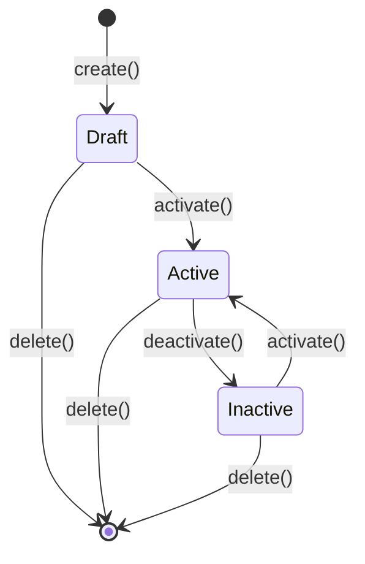
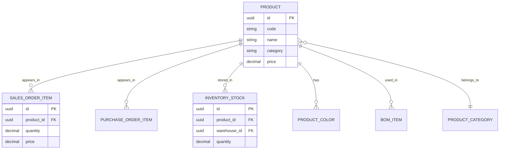

# 产品 (Product)

产品是冰溪 ERP 系统中的核心业务实体，代表面料纺织行业的产品。产品支持五维管理（产品-批次-色号-缸号-等级），是销售、采购、库存、生产等业务模块的基础。

## 什么是产品？

产品代表企业生产和销售的面料产品。每个产品具有唯一标识，并包含详细的属性信息，如名称、规格、颜色、价格等。产品是连接销售、采购、库存、生产等业务流程的核心纽带。

**关键特征**:
- 五维管理（产品-批次-色号-缸号-等级）
- 双计量单位（米/公斤）
- 批次追踪
- 价格管理
- 库存关联

## 代码位置

| 方面 | 位置 |
|------|------|
| 模型/类型 | `backend/src/models/product.rs` |
| 服务 | `backend/src/services/product_service.rs` |
| API 路由 | `/api/v1/erp/products` |
| 处理器 | `backend/src/handlers/product_handler.rs` |
| 数据库 | `products` 表 |
| 测试 | `backend/tests/test_product.rs` |

## 结构

```rust
#[derive(Clone, Debug, PartialEq, DeriveEntityModel)]
#[sea_orm(table_name = "products")]
pub struct Model {
    #[sea_orm(primary_key)]
    pub id: Uuid,
    pub code: String,
    pub name: String,
    pub category: String,
    pub description: Option<String>,
    pub unit: String,           // 米、公斤、件等
    pub secondary_unit: Option<String>, // 次要单位
    pub conversion_rate: Option<Decimal>, // 单位换算率
    pub price: Decimal,
    pub cost: Option<Decimal>,
    pub min_stock: Option<Decimal>,
    pub max_stock: Option<Decimal>,
    pub status: String,         // active, inactive
    pub tenant_id: Option<Uuid>,
    pub created_at: DateTimeWithTimeZone,
    pub updated_at: DateTimeWithTimeZone,
}
```

### 关键字段

| 字段 | 类型 | 描述 | 约束 |
|------|------|------|------|
| `id` | `Uuid` | 唯一标识 | UUID，不可变 |
| `code` | `String` | 产品编码 | 唯一，系统生成 |
| `name` | `String` | 产品名称 | 必填，1-200 字符 |
| `category` | `String` | 产品分类 | 必填，预定义分类 |
| `unit` | `String` | 主要计量单位 | 米、公斤、件 |
| `secondary_unit` | `Option<String>` | 次要计量单位 | 可选 |
| `conversion_rate` | `Option<Decimal>` | 单位换算率 | 双单位时必填 |
| `price` | `Decimal` | 销售价格 | 必填，大于 0 |
| `cost` | `Option<Decimal>` | 成本价格 | 可选 |
| `min_stock` | `Option<Decimal>` | 最低库存 | 可选，库存预警 |
| `max_stock` | `Option<Decimal>` | 最高库存 | 可选，库存预警 |

## 不变量

这些规则对有效的产品必须始终成立：

1. **产品编码唯一性**: 系统内产品编码必须唯一
   - 示例："不能创建两个编码为 'FABRIC-001' 的产品"

2. **价格有效性**: 价格必须大于 0
   - 示例："销售价格不能为负数或零"

3. **单位有效性**: 计量单位必须是预定义值之一
   - 示例："单位只能是米、公斤、件等"

4. **库存阈值**: 最低库存不能大于最高库存
   - 示例："最低库存 100 不能大于最高库存 50"

## 生命周期



### 状态描述

| 状态 | 描述 | 允许的转换 |
|------|------|-----------|
| `draft` | 草稿状态，可编辑 | → active |
| `active` | 正常使用状态 | → inactive |
| `inactive` | 停用状态 | → active |
| `deleted` | 已删除（软删除） | （终态） |

## 关系



| 关联概念 | 关系 | 描述 |
|---------|------|------|
| 销售订单项 (SalesOrderItem) | 一对多 | 产品可以出现在多个销售订单中 |
| 采购订单项 (PurchaseOrderItem) | 一对多 | 产品可以出现在多个采购订单中 |
| 库存 (InventoryStock) | 一对多 | 产品在多个仓库有库存 |
| 产品颜色 (ProductColor) | 一对多 | 产品可以有多个颜色 |
| BOM 项 (BomItem) | 一对多 | 产品可以用于多个 BOM |
| 产品分类 (ProductCategory) | 多对一 | 产品属于一个分类 |

## 五维管理

面料行业特有的产品管理维度：

### 1. 产品维度
- 产品编码
- 产品名称
- 产品分类

### 2. 批次维度
- 批次号
- 生产日期
- 供应商

### 3. 色号维度
- 色号编码
- 颜色名称
- 色卡参考

### 4. 缸号维度
- 缸号编码
- 染色日期
- 染色配方

### 5. 等级维度
- 质量等级
- 检验结果
- 备注信息

## 双计量单位

面料产品通常需要同时按米和公斤计量：

```rust
pub struct DualUnit {
    pub primary_unit: String,      // 主要单位（米）
    pub secondary_unit: String,    // 次要单位（公斤）
    pub conversion_rate: Decimal,  // 换算率
}

impl DualUnit {
    pub fn convert_to_secondary(&self, primary_qty: Decimal) -> Decimal {
        primary_qty * self.conversion_rate
    }
    
    pub fn convert_to_primary(&self, secondary_qty: Decimal) -> Decimal {
        secondary_qty / self.conversion_rate
    }
}
```

## 价格管理

### 价格策略

1. **基础价格**: 产品的标准销售价格
2. **客户价格**: 针对特定客户的优惠价格
3. **批量价格**: 根据购买数量的阶梯价格
4. **促销价格**: 特定时期的促销价格

### 价格查询

```rust
pub async fn get_effective_price(
    db: &DatabaseConnection,
    product_id: Uuid,
    customer_id: Option<Uuid>,
    quantity: Decimal,
) -> Result<Decimal, AppError> {
    // 1. 检查促销价格
    if let Some(promo_price) = get_promotion_price(db, product_id).await? {
        return Ok(promo_price);
    }
    
    // 2. 检查客户专属价格
    if let Some(customer_id) = customer_id {
        if let Some(customer_price) = get_customer_price(db, product_id, customer_id).await? {
            return Ok(customer_price);
        }
    }
    
    // 3. 检查批量价格
    if let Some(batch_price) = get_batch_price(db, product_id, quantity).await? {
        return Ok(batch_price);
    }
    
    // 4. 返回基础价格
    get_base_price(db, product_id).await
}
```

## API 操作

### 产品管理 API

| 操作 | 方法 | 路径 | 描述 |
|------|------|------|------|
| 创建产品 | POST | `/api/v1/erp/products` | 创建新产品 |
| 获取产品列表 | GET | `/api/v1/erp/products` | 分页获取产品列表 |
| 获取产品详情 | GET | `/api/v1/erp/products/{id}` | 获取指定产品信息 |
| 更新产品 | PUT | `/api/v1/erp/products/{id}` | 更新产品信息 |
| 删除产品 | DELETE | `/api/v1/erp/products/{id}` | 删除产品（软删除） |
| 批量导入 | POST | `/api/v1/erp/products/import` | 批量导入产品数据 |
| 导出数据 | GET | `/api/v1/erp/products/export` | 导出产品数据 |
| 添加颜色 | POST | `/api/v1/erp/products/{id}/colors` | 为产品添加颜色 |
| 获取颜色列表 | GET | `/api/v1/erp/products/{id}/colors` | 获取产品颜色列表 |

### 查询参数

| 参数 | 类型 | 描述 | 示例 |
|------|------|------|------|
| `page` | `int` | 页码 | `?page=1` |
| `pageSize` | `int` | 每页数量 | `?pageSize=20` |
| `category` | `string` | 产品分类 | `?category=fabric` |
| `status` | `string` | 产品状态 | `?status=active` |
| `keyword` | `string` | 搜索关键词 | `?keyword=棉布` |

## 前端实现

### 产品 API

```typescript
// frontend/src/api/product.ts
export const productApi = {
  getList(params?: ProductQueryParams) {
    return request.get<{ items: Product[]; total: number }>('/products', { params })
  },
  
  getById(id: string) {
    return request.get<Product>(`/products/${id}`)
  },
  
  create(data: CreateProductRequest) {
    return request.post<Product>('/products', data)
  },
  
  update(id: string, data: UpdateProductRequest) {
    return request.put<Product>(`/products/${id}`, data)
  },
  
  delete(id: string) {
    return request.delete(`/products/${id}`)
  },
  
  import(file: File) {
    const formData = new FormData()
    formData.append('file', file)
    return request.post('/products/import', formData)
  },
  
  export(params?: ProductQueryParams) {
    return request.get('/products/export', { 
      params,
      responseType: 'blob'
    })
  },
}
```

### 产品页面

```vue
<!-- frontend/src/views/product/index.vue -->
<template>
  <div class="product-page">
    <el-card>
      <template #header>
        <div class="card-header">
          <span>产品管理</span>
          <div class="actions">
            <el-button type="primary" @click="handleCreate">新建产品</el-button>
            <el-button @click="handleImport">导入</el-button>
            <el-button @click="handleExport">导出</el-button>
          </div>
        </div>
      </template>
      
      <el-table :data="products" v-loading="loading">
        <el-table-column prop="code" label="产品编码" />
        <el-table-column prop="name" label="产品名称" />
        <el-table-column prop="category" label="分类" />
        <el-table-column prop="price" label="价格" />
        <el-table-column prop="unit" label="单位" />
        <el-table-column prop="status" label="状态">
          <template #default="{ row }">
            <el-tag :type="row.status === 'active' ? 'success' : 'info'">
              {{ row.status === 'active' ? '启用' : '停用' }}
            </el-tag>
          </template>
        </el-table-column>
        <el-table-column label="操作" width="200">
          <template #default="{ row }">
            <el-button size="small" @click="handleEdit(row)">编辑</el-button>
            <el-button size="small" @click="handleColors(row)">颜色</el-button>
            <el-button size="small" type="danger" @click="handleDelete(row)">删除</el-button>
          </template>
        </el-table-column>
      </el-table>
    </el-card>
  </div>
</template>
```

## 测试

### 单元测试

```rust
#[tokio::test]
async fn test_create_product() {
    let db = MockDatabase::new()
        .append_query_results(vec![vec![product_model()]])
        .into_connection();
    
    let result = ProductService::create(&db, CreateProductRequest {
        code: "FABRIC-001".to_string(),
        name: "纯棉面料".to_string(),
        category: "fabric".to_string(),
        unit: "meter".to_string(),
        price: Decimal::from(25),
    }).await;
    
    assert!(result.is_ok());
}

#[tokio::test]
async fn test_duplicate_product_code() {
    // 测试产品编码重复检查
}
```

### 集成测试

```rust
#[tokio::test]
async fn test_product_lifecycle() {
    // 测试产品完整生命周期
    // 1. 创建产品
    // 2. 添加颜色
    // 3. 设置价格
    // 4. 查询产品
    // 5. 更新产品
    // 6. 删除产品
}
```

## 最佳实践

1. **编码规范**: 使用统一的编码规则，便于识别和管理
2. **分类管理**: 合理设置产品分类，便于查询和统计
3. **价格策略**: 根据客户类型和购买数量设置合理的价格策略
4. **库存预警**: 设置合理的最低和最高库存阈值
5. **批次管理**: 对于需要追溯的产品，启用批次管理
6. **定期盘点**: 定期进行库存盘点，确保数据准确性

## 常见问题

### 产品编码重复

**可能原因**:
1. 手动输入编码时重复
2. 导入数据时编码冲突

**解决方案**:
1. 使用系统自动生成编码
2. 导入前检查编码唯一性

### 价格计算错误

**可能原因**:
1. 单位换算率设置错误
2. 价格策略配置错误

**解决方案**:
1. 检查单位换算率
2. 验证价格策略配置

## 代码位置(自动维护)

<!-- AUTO-GENERATED-START: concept_product -->
> 本节由 monkeycode-sync 维护,首次启用时为空。
<!-- AUTO-GENERATED-END: concept_product -->
