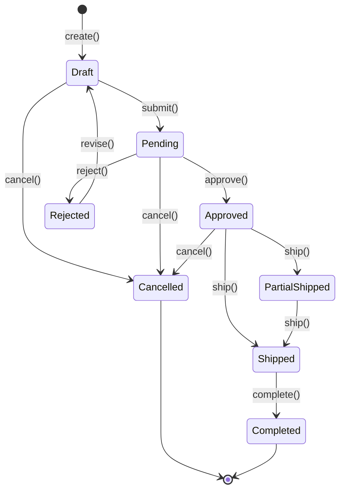
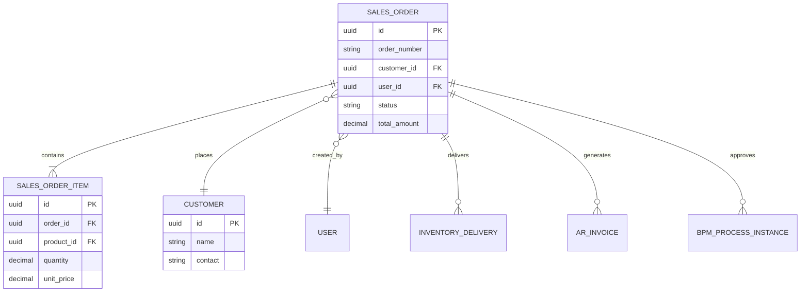

# 销售订单 (SalesOrder)

销售订单是冰溪 ERP 系统中的核心业务实体，代表客户购买产品的交易。销售订单管理从订单创建到完成的整个生命周期，包括审批、发货、收款等环节。

## 什么是销售订单？

销售订单记录了客户购买产品的详细信息，包括客户信息、产品明细、价格、数量、交货日期等。销售订单是销售管理的核心，连接客户、产品、库存、财务等业务模块。

**关键特征**:
- 完整的订单生命周期管理
- 多级审批流程
- 库存预留和发货管理
- 应收账款生成
- 销售分析和预测

## 代码位置

| 方面 | 位置 |
|------|------|
| 模型/类型 | `backend/src/models/sales_order.rs` |
| 服务 | `backend/src/services/sales_order_service.rs` |
| API 路由 | `/api/v1/erp/sales/orders` |
| 处理器 | `backend/src/handlers/sales_order_handler.rs` |
| 数据库 | `sales_orders` 表 |
| 测试 | `backend/tests/test_sales_flow.rs` |

## 结构

```rust
#[derive(Clone, Debug, PartialEq, DeriveEntityModel)]
#[sea_orm(table_name = "sales_orders")]
pub struct Model {
    #[sea_orm(primary_key)]
    pub id: Uuid,
    pub order_number: String,
    pub customer_id: Uuid,
    pub user_id: Uuid,
    pub order_date: Date,
    pub delivery_date: Option<Date>,
    pub status: String,
    pub total_amount: Decimal,
    pub discount_amount: Option<Decimal>,
    pub tax_amount: Option<Decimal>,
    pub net_amount: Decimal,
    pub currency: String,
    pub exchange_rate: Option<Decimal>,
    pub payment_terms: Option<String>,
    pub shipping_address: Option<String>,
    pub notes: Option<String>,
    pub tenant_id: Option<Uuid>,
    pub created_at: DateTimeWithTimeZone,
    pub updated_at: DateTimeWithTimeZone,
}

#[derive(Clone, Debug, PartialEq, DeriveEntityModel)]
#[sea_orm(table_name = "sales_order_items")]
pub struct ItemModel {
    #[sea_orm(primary_key)]
    pub id: Uuid,
    pub order_id: Uuid,
    pub product_id: Uuid,
    pub quantity: Decimal,
    pub unit_price: Decimal,
    pub discount_rate: Option<Decimal>,
    pub tax_rate: Option<Decimal>,
    pub amount: Decimal,
    pub delivered_quantity: Option<Decimal>,
    pub notes: Option<String>,
}
```

### 关键字段

| 字段 | 类型 | 描述 | 约束 |
|------|------|------|------|
| `id` | `Uuid` | 唯一标识 | UUID，不可变 |
| `order_number` | `String` | 订单编号 | 唯一，系统生成 |
| `customer_id` | `Uuid` | 客户 ID | 必填，关联客户表 |
| `user_id` | `Uuid` | 创建用户 ID | 必填，关联用户表 |
| `order_date` | `Date` | 订单日期 | 必填 |
| `delivery_date` | `Option<Date>` | 交货日期 | 可选 |
| `status` | `String` | 订单状态 | 见生命周期 |
| `total_amount` | `Decimal` | 总金额 | 必填，大于 0 |
| `net_amount` | `Decimal` | 净金额 | 必填，计算得出 |
| `currency` | `String` | 货币类型 | 必填，默认 CNY |

## 不变量

这些规则对有效的销售订单必须始终成立：

1. **订单编号唯一性**: 系统内订单编号必须唯一
   - 示例："不能创建两个编号为 'SO-2026-001' 的订单"

2. **金额一致性**: 净金额 = 总金额 - 折扣 + 税额
   - 示例："净金额必须等于总金额减去折扣加上税额"

3. **数量有效性**: 数量必须大于 0
   - 示例："销售数量不能为负数或零"

4. **库存可用性**: 下单时检查库存是否充足
   - 示例："库存不足时不能创建订单"

## 生命周期



### 状态描述

| 状态 | 描述 | 允许的转换 |
|------|------|-----------|
| `draft` | 草稿状态，可编辑 | → pending, cancelled |
| `pending` | 待审批状态 | → approved, rejected, cancelled |
| `approved` | 已批准，等待发货 | → partial_shipped, shipped, cancelled |
| `rejected` | 已拒绝 | → draft |
| `partial_shipped` | 部分发货 | → shipped |
| `shipped` | 已发货 | → completed |
| `completed` | 已完成 | （终态） |
| `cancelled` | 已取消 | （终态） |

## 关系



| 关联概念 | 关系 | 描述 |
|---------|------|------|
| 客户 (Customer) | 多对一 | 每个订单属于一个客户 |
| 用户 (User) | 多对一 | 每个订单由一个用户创建 |
| 销售订单项 (SalesOrderItem) | 一对多 | 订单包含多个订单项 |
| 库存发货 (InventoryDelivery) | 一对多 | 订单可以多次发货 |
| 应收发票 (ArInvoice) | 一对多 | 订单生成应收发票 |
| BPM 流程 (BpmProcessInstance) | 一对一 | 订单关联审批流程 |

## 价格计算

### 价格策略

```rust
pub struct PriceCalculation {
    pub base_price: Decimal,
    pub customer_discount: Option<Decimal>,
    pub quantity_discount: Option<Decimal>,
    pub promotion_discount: Option<Decimal>,
    pub tax_rate: Decimal,
}

impl PriceCalculation {
    pub fn calculate(&self, quantity: Decimal) -> OrderAmount {
        let line_amount = self.base_price * quantity;
        
        // 应用折扣
        let discount_amount = self.calculate_discount(line_amount);
        let discounted_amount = line_amount - discount_amount;
        
        // 计算税额
        let tax_amount = discounted_amount * self.tax_rate / 100;
        
        // 计算净金额
        let net_amount = discounted_amount + tax_amount;
        
        OrderAmount {
            total_amount: line_amount,
            discount_amount,
            tax_amount,
            net_amount,
        }
    }
}
```

### 批量价格

```rust
pub fn get_quantity_discount(quantity: Decimal) -> Option<Decimal> {
    match quantity {
        q if q >= 1000 => Some(Decimal::from(10)), // 10% 折扣
        q if q >= 500 => Some(Decimal::from(5)),   // 5% 折扣
        q if q >= 100 => Some(Decimal::from(2)),   // 2% 折扣
        _ => None,
    }
}
```

## 库存管理

### 库存预留

创建订单时，系统自动预留库存：

```rust
pub async fn reserve_inventory(
    db: &DatabaseConnection,
    order_id: Uuid,
) -> Result<(), AppError> {
    let order_items = SalesOrderItem::find()
        .filter(sales_order_item::Column::OrderId.eq(order_id))
        .all(db)
        .await?;
    
    for item in order_items {
        let stock = InventoryStock::find()
            .filter(inventory_stock::Column::ProductId.eq(item.product_id))
            .one(db)
            .await?
            .ok_or(AppError::InsufficientStock)?;
        
        if stock.available_quantity() < item.quantity {
            return Err(AppError::InsufficientStock);
        }
        
        // 更新预留数量
        let mut active_model: inventory_stock::ActiveModel = stock.into();
        active_model.reserved_quantity = Set(
            stock.reserved_quantity + item.quantity
        );
        active_model.update(db).await?;
    }
    
    Ok(())
}
```

### 发货管理

```rust
pub async fn ship_order(
    db: &DatabaseConnection,
    order_id: Uuid,
    shipping_data: ShippingRequest,
) -> Result<ShippingResult, AppError> {
    // 1. 检查订单状态
    let order = SalesOrder::find_by_id(order_id)
        .one(db)
        .await?
        .ok_or(AppError::OrderNotFound)?;
    
    if order.status != "approved" {
        return Err(AppError::InvalidOrderStatus);
    }
    
    // 2. 创建发货记录
    let delivery = InventoryDelivery::create(db, order_id, shipping_data).await?;
    
    // 3. 更新库存
    InventoryService::reduce_stock(db, delivery.items).await?;
    
    // 4. 更新订单状态
    let new_status = if delivery.is_full_shipped() {
        "shipped"
    } else {
        "partial_shipped"
    };
    
    SalesOrder::update_status(db, order_id, new_status).await?;
    
    Ok(ShippingResult {
        delivery_id: delivery.id,
        status: new_status.to_string(),
    })
}
```

## 审批流程

### BPM 集成

销售订单集成 BPM 审批流程：

```rust
pub async fn submit_for_approval(
    db: &DatabaseConnection,
    order_id: Uuid,
) -> Result<(), AppError> {
    // 1. 检查订单状态
    let order = SalesOrder::find_by_id(order_id)
        .one(db)
        .await?
        .ok_or(AppError::OrderNotFound)?;
    
    if order.status != "draft" {
        return Err(AppError::InvalidOrderStatus);
    }
    
    // 2. 启动 BPM 流程
    let process_instance = BpmService::start_process(
        db,
        "sales_order_approval",
        order_id,
        json!({
            "order_number": order.order_number,
            "customer_name": order.customer.name,
            "total_amount": order.total_amount,
        }),
    ).await?;
    
    // 3. 更新订单状态
    SalesOrder::update_status(db, order_id, "pending").await?;
    
    Ok(())
}
```

### 审批规则

```rust
pub fn check_approval_rules(order: &SalesOrder) -> Vec<ApprovalRule> {
    let mut rules = Vec::new();
    
    // 金额审批规则
    if order.total_amount > Decimal::from(100000) {
        rules.push(ApprovalRule::RequiresManagerApproval);
    }
    
    if order.total_amount > Decimal::from(500000) {
        rules.push(ApprovalRule::RequiresDirectorApproval);
    }
    
    // 客户信用审批规则
    if order.customer.credit_rating < 3 {
        rules.push(ApprovalRule::RequiresCreditApproval);
    }
    
    rules
}
```

## API 操作

### 销售订单 API

| 操作 | 方法 | 路径 | 描述 |
|------|------|------|------|
| 创建订单 | POST | `/api/v1/erp/sales/orders` | 创建新销售订单 |
| 获取订单列表 | GET | `/api/v1/erp/sales/orders` | 分页获取订单列表 |
| 获取订单详情 | GET | `/api/v1/erp/sales/orders/{id}` | 获取指定订单信息 |
| 更新订单 | PUT | `/api/v1/erp/sales/orders/{id}` | 更新订单信息 |
| 删除订单 | DELETE | `/api/v1/erp/sales/orders/{id}` | 删除订单（草稿状态） |
| 提交审批 | POST | `/api/v1/erp/sales/orders/{id}/submit` | 提交订单审批 |
| 审批订单 | POST | `/api/v1/erp/sales/orders/{id}/approve` | 审批订单 |
| 订单发货 | POST | `/api/v1/erp/sales/orders/{id}/ship` | 订单发货 |
| 完成订单 | POST | `/api/v1/erp/sales/orders/{id}/complete` | 完成订单 |

### 查询参数

| 参数 | 类型 | 描述 | 示例 |
|------|------|------|------|
| `page` | `int` | 页码 | `?page=1` |
| `pageSize` | `int` | 每页数量 | `?pageSize=20` |
| `status` | `string` | 订单状态 | `?status=approved` |
| `customer_id` | `string` | 客户 ID | `?customer_id=uuid` |
| `date_from` | `date` | 开始日期 | `?date_from=2026-01-01` |
| `date_to` | `date` | 结束日期 | `?date_to=2026-12-31` |

## 前端实现

### 销售订单 API

```typescript
// frontend/src/api/sales.ts
export const salesOrderApi = {
  getList(params?: SalesOrderQueryParams) {
    return request.get<{ items: SalesOrder[]; total: number }>('/sales/orders', { params })
  },
  
  getById(id: string) {
    return request.get<SalesOrder>(`/sales/orders/${id}`)
  },
  
  create(data: CreateSalesOrderRequest) {
    return request.post<SalesOrder>('/sales/orders', data)
  },
  
  update(id: string, data: UpdateSalesOrderRequest) {
    return request.put<SalesOrder>(`/sales/orders/${id}`, data)
  },
  
  delete(id: string) {
    return request.delete(`/sales/orders/${id}`)
  },
  
  submit(id: string) {
    return request.post(`/sales/orders/${id}/submit`)
  },
  
  approve(id: string, data: ApprovalRequest) {
    return request.post(`/sales/orders/${id}/approve`, data)
  },
  
  ship(id: string, data: ShippingRequest) {
    return request.post(`/sales/orders/${id}/ship`, data)
  },
  
  complete(id: string) {
    return request.post(`/sales/orders/${id}/complete`)
  },
}
```

### 销售订单页面

```vue
<!-- frontend/src/views/sales/index.vue -->
<template>
  <div class="sales-order-page">
    <el-card>
      <template #header>
        <div class="card-header">
          <span>销售订单</span>
          <el-button type="primary" @click="handleCreate">新建订单</el-button>
        </div>
      </template>
      
      <el-table :data="orders" v-loading="loading">
        <el-table-column prop="order_number" label="订单编号" />
        <el-table-column prop="customer.name" label="客户" />
        <el-table-column prop="order_date" label="订单日期" />
        <el-table-column prop="total_amount" label="总金额" />
        <el-table-column prop="status" label="状态">
          <template #default="{ row }">
            <el-tag :type="getStatusType(row.status)">
              {{ getStatusLabel(row.status) }}
            </el-tag>
          </template>
        </el-table-column>
        <el-table-column label="操作" width="200">
          <template #default="{ row }">
            <el-button size="small" @click="handleView(row)">查看</el-button>
            <el-button 
              v-if="row.status === 'draft'" 
              size="small" 
              @click="handleSubmit(row)"
            >
              提交
            </el-button>
          </template>
        </el-table-column>
      </el-table>
    </el-card>
  </div>
</template>
```

## 测试

### 单元测试

```rust
#[tokio::test]
async fn test_create_sales_order() {
    let db = MockDatabase::new()
        .append_query_results(vec![vec![sales_order_model()]])
        .into_connection();
    
    let result = SalesOrderService::create(&db, CreateSalesOrderRequest {
        customer_id: Uuid::new_v4(),
        items: vec![
            CreateOrderItem {
                product_id: Uuid::new_v4(),
                quantity: Decimal::from(100),
                unit_price: Decimal::from(25),
            },
        ],
    }).await;
    
    assert!(result.is_ok());
}

#[tokio::test]
async fn test_submit_order() {
    // 测试订单提交审批
}
```

### 集成测试

```rust
#[tokio::test]
async fn test_sales_order_lifecycle() {
    // 测试销售订单完整生命周期
    // 1. 创建订单
    // 2. 添加订单项
    // 3. 提交审批
    // 4. 审批通过
    // 5. 发货
    // 6. 完成订单
}
```

## 最佳实践

1. **订单编号**: 使用有意义的编号规则，便于识别和查询
2. **价格策略**: 合理设置价格策略，提高竞争力
3. **库存预留**: 及时预留库存，避免超卖
4. **审批流程**: 根据金额和客户信用设置合理的审批流程
5. **发货管理**: 及时发货，提高客户满意度
6. **应收账款**: 及时生成应收账款，加快资金回笼

## 常见问题

### 库存不足

**可能原因**:
1. 库存数据不准确
2. 库存已被其他订单预留
3. 库存预警未及时处理

**解决方案**:
1. 定期进行库存盘点
2. 检查库存预留情况
3. 设置合理的库存预警

### 审批流程卡住

**可能原因**:
1. 审批人未及时处理
2. 审批规则配置错误
3. 系统故障

**解决方案**:
1. 设置审批超时提醒
2. 检查审批规则配置
3. 联系系统管理员

## 代码位置(自动维护)

<!-- AUTO-GENERATED-START: concept_sales_order -->
> 本节由 monkeycode-sync 维护,首次启用时为空。
<!-- AUTO-GENERATED-END: concept_sales_order -->
