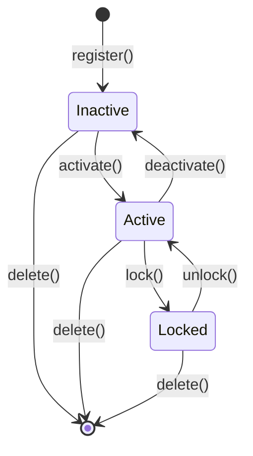
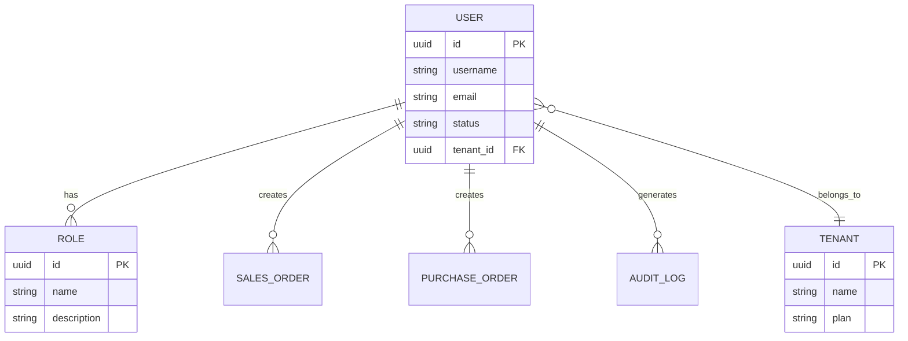

# 用户 (User)

用户是冰溪 ERP 系统的核心实体，代表系统的使用者。用户通过认证获得访问权限，并根据角色和权限执行不同的操作。

## 什么是用户？

用户代表系统中的操作者，可以是企业员工、管理人员或系统管理员。每个用户拥有唯一的身份标识，并通过角色和权限控制其可访问的功能和数据范围。

**关键特征**:
- 唯一身份标识（UUID）
- 用户名和邮箱认证
- 密码安全存储（Argon2 哈希）
- 角色和权限管理
- 多租户支持
- TOTP 两步验证（可选）

## 代码位置

| 方面 | 位置 |
|------|------|
| 模型/类型 | `backend/src/models/user.rs` |
| 服务 | `backend/src/services/user_service.rs` |
| API 路由 | `/api/v1/erp/users` |
| 处理器 | `backend/src/handlers/user_handler.rs` |
| 数据库 | `users` 表 |
| 测试 | `backend/tests/test_password_validator.rs` |

## 结构

```rust
#[derive(Clone, Debug, PartialEq, DeriveEntityModel)]
#[sea_orm(table_name = "users")]
pub struct Model {
    #[sea_orm(primary_key)]
    pub id: Uuid,
    pub username: String,
    pub email: String,
    pub password_hash: String,
    pub full_name: Option<String>,
    pub phone: Option<String>,
    pub avatar: Option<String>,
    pub status: String, // active, inactive, locked
    pub tenant_id: Option<Uuid>,
    pub last_login_at: Option<DateTimeWithTimeZone>,
    pub created_at: DateTimeWithTimeZone,
    pub updated_at: DateTimeWithTimeZone,
}
```

### 关键字段

| 字段 | 类型 | 描述 | 约束 |
|------|------|------|------|
| `id` | `Uuid` | 唯一标识 | UUID，不可变 |
| `username` | `String` | 用户名 | 唯一，3-50 字符 |
| `email` | `String` | 邮箱地址 | 唯一，有效邮箱格式 |
| `password_hash` | `String` | 密码哈希 | Argon2 哈希，不可逆 |
| `status` | `String` | 账户状态 | active, inactive, locked |
| `tenant_id` | `Option<Uuid>` | 租户 ID | 多租户模式下必填 |
| `last_login_at` | `Option<DateTime>` | 最后登录时间 | 自动更新 |

## 不变量

这些规则对有效的用户必须始终成立：

1. **用户名唯一性**: 同一租户内用户名必须唯一
   - 示例："不能创建两个用户名为 'admin' 的用户"

2. **邮箱唯一性**: 系统内邮箱地址必须唯一
   - 示例："不能使用已注册的邮箱创建新用户"

3. **密码强度**: 密码必须满足强度要求
   - 示例："密码长度至少 8 位，包含大小写字母和数字"

4. **状态有效性**: 用户状态必须是预定义值之一
   - 示例："状态只能是 active、inactive 或 locked"

## 生命周期



### 状态描述

| 状态 | 描述 | 允许的转换 |
|------|------|-----------|
| `inactive` | 注册未激活，等待验证 | → active |
| `active` | 正常使用状态 | → locked, inactive |
| `locked` | 账户被锁定（安全原因） | → active |
| `deleted` | 已删除（软删除） | （终态） |

## 关系



| 关联概念 | 关系 | 描述 |
|---------|------|------|
| 角色 (Role) | 多对多 | 用户可以拥有多个角色，角色可以分配给多个用户 |
| 租户 (Tenant) | 多对一 | 每个用户属于一个租户（多租户模式） |
| 销售订单 (SalesOrder) | 一对多 | 用户可以创建多个销售订单 |
| 采购订单 (PurchaseOrder) | 一对多 | 用户可以创建多个采购订单 |
| 审计日志 (AuditLog) | 一对多 | 用户的所有操作都会被记录 |

## 认证机制

### JWT Token

用户登录后获得 JWT Token，用于后续 API 访问：

```json
{
  "sub": "user-uuid",
  "iat": 1625097600,
  "exp": 1625101200,
  "tenant_id": "tenant-uuid",
  "roles": ["admin", "user"]
}
```

### 密码安全

- 使用 Argon2 算法进行密码哈希
- 支持密码强度验证
- 登录失败次数限制（防暴力破解）
- 密码重置功能

### TOTP 两步验证

可选的安全增强功能：

1. 用户启用 TOTP
2. 系统生成密钥和 QR 码
3. 用户使用认证器应用扫描
4. 登录时需要验证码

## 权限模型

### 角色权限

```rust
#[derive(Clone, Debug, PartialEq, DeriveEntityModel)]
#[sea_orm(table_name = "roles")]
pub struct Model {
    pub id: Uuid,
    pub name: String,
    pub description: Option<String>,
    pub tenant_id: Option<Uuid>,
}

#[derive(Clone, Debug, PartialEq, DeriveEntityModel)]
#[sea_orm(table_name = "role_permissions")]
pub struct Model {
    pub id: Uuid,
    pub role_id: Uuid,
    pub resource: String,  // 如 "sales.order"
    pub action: String,    // 如 "create", "read", "update", "delete"
}
```

### 数据权限

控制用户可访问的数据范围：

- **全部数据**: 可访问所有数据
- **本部门数据**: 只能访问本部门数据
- **本人数据**: 只能访问自己创建的数据
- **自定义数据**: 根据业务规则过滤

### 字段权限

控制用户可查看和编辑的字段：

- **可见字段**: 用户可以看到的字段
- **可编辑字段**: 用户可以修改的字段
- **脱敏字段**: 敏感信息的脱敏显示

## API 操作

### 用户管理 API

| 操作 | 方法 | 路径 | 描述 |
|------|------|------|------|
| 创建用户 | POST | `/api/v1/erp/users` | 创建新用户 |
| 获取用户列表 | GET | `/api/v1/erp/users` | 分页获取用户列表 |
| 获取用户详情 | GET | `/api/v1/erp/users/{id}` | 获取指定用户信息 |
| 更新用户 | PUT | `/api/v1/erp/users/{id}` | 更新用户信息 |
| 删除用户 | DELETE | `/api/v1/erp/users/{id}` | 删除用户（软删除） |
| 重置密码 | POST | `/api/v1/erp/users/{id}/reset-password` | 重置用户密码 |
| 分配角色 | PUT | `/api/v1/erp/users/{id}/roles` | 为用户分配角色 |

### 认证 API

| 操作 | 方法 | 路径 | 描述 |
|------|------|------|------|
| 用户登录 | POST | `/api/v1/erp/auth/login` | 用户名密码登录 |
| 用户登出 | POST | `/api/v1/erp/auth/logout` | 注销 Token |
| 刷新 Token | POST | `/api/v1/erp/auth/refresh` | 刷新访问令牌 |
| 设置 TOTP | POST | `/api/v1/erp/auth/totp/setup` | 设置两步验证 |
| 验证 TOTP | POST | `/api/v1/erp/auth/totp/verify` | 验证 TOTP 验证码 |

## 前端实现

### 用户 Store

```typescript
// frontend/src/store/user.ts
export const useUserStore = defineStore('user', () => {
  const user = ref<UserInfo | null>(null)
  const token = ref<string>('')
  
  const login = async (credentials: LoginRequest) => {
    const { data } = await authApi.login(credentials)
    token.value = data.token
    user.value = data.user
    localStorage.setItem('token', data.token)
  }
  
  const logout = async () => {
    await authApi.logout()
    token.value = ''
    user.value = null
    localStorage.removeItem('token')
  }
  
  return { user, token, login, logout }
})
```

### 权限指令

```typescript
// frontend/src/directives/permission.ts
export const vPermission = {
  mounted(el: HTMLElement, binding: DirectiveBinding) {
    const { value } = binding
    const userStore = useUserStore()
    
    if (!userStore.hasPermission(value)) {
      el.parentNode?.removeChild(el)
    }
  }
}

// 使用示例
// <button v-permission="'user:create'">创建用户</button>
```

## 测试

### 单元测试

```rust
#[tokio::test]
async fn test_create_user() {
    let db = MockDatabase::new()
        .append_query_results(vec![vec![user_model()]])
        .into_connection();
    
    let result = UserService::create(&db, CreateUserRequest {
        username: "testuser".to_string(),
        email: "test@example.com".to_string(),
        password: "Password123".to_string(),
    }).await;
    
    assert!(result.is_ok());
}

#[tokio::test]
async fn test_duplicate_username() {
    // 测试用户名重复检查
}
```

### 集成测试

```rust
#[tokio::test]
async fn test_auth_flow() {
    // 测试完整的认证流程
    // 1. 注册用户
    // 2. 登录获取 Token
    // 3. 使用 Token 访问 API
    // 4. 刷新 Token
    // 5. 登出
}
```

## 最佳实践

1. **密码安全**: 使用强密码策略，定期更换密码
2. **权限最小化**: 只授予必要的权限
3. **定期审计**: 定期审查用户权限和访问日志
4. **多因素认证**: 对敏感操作启用 TOTP
5. **账户锁定**: 设置登录失败次数限制
6. **会话管理**: 合理设置 Token 过期时间

## 常见问题

### 用户无法登录

**可能原因**:
1. 用户名或密码错误
2. 账户被锁定
3. Token 过期
4. 网络连接问题

**解决方案**:
1. 检查用户名密码
2. 联系管理员解锁账户
3. 清除浏览器缓存重新登录
4. 检查网络连接

### 权限不足

**可能原因**:
1. 角色未分配
2. 权限配置错误
3. 数据权限限制

**解决方案**:
1. 检查用户角色分配
2. 验证角色权限配置
3. 检查数据权限设置