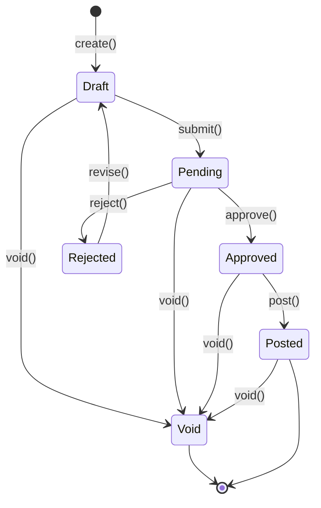
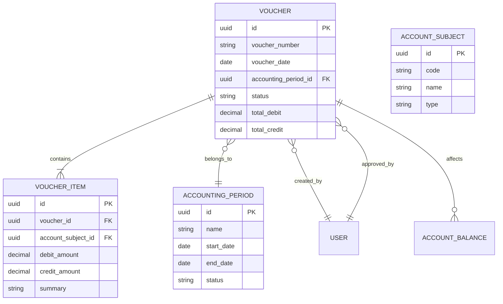

# 财务凭证 (Voucher)

财务凭证是冰溪 ERP 系统中的核心财务实体，代表企业的会计凭证。财务凭证管理包括凭证的创建、审核、记账、结账等功能，是财务管理的核心。

## 什么是财务凭证？

财务凭证记录了企业的每一笔经济业务，包括借方和贷方的会计科目、金额、摘要等信息。财务凭证是会计核算的基础，是生成财务报表的依据。

**关键特征**:
- 借贷平衡
- 多级审核
- 会计期间管理
- 自动生成
- 审计追踪

## 代码位置

| 方面 | 位置 |
|------|------|
| 模型/类型 | `backend/src/models/voucher.rs` |
| 服务 | `backend/src/services/voucher_service.rs` |
| API 路由 | `/api/v1/erp/finance/vouchers` |
| 处理器 | `backend/src/handlers/voucher_handler.rs` |
| 数据库 | `vouchers` 表 |
| 测试 | `backend/tests/test_voucher.rs` |

## 结构

```rust
#[derive(Clone, Debug, PartialEq, DeriveEntityModel)]
#[sea_orm(table_name = "vouchers")]
pub struct Model {
    #[sea_orm(primary_key)]
    pub id: Uuid,
    pub voucher_number: String,
    pub voucher_date: Date,
    pub accounting_period_id: Uuid,
    pub voucher_type: String,
    pub total_debit: Decimal,
    pub total_credit: Decimal,
    pub status: String,
    pub source_type: Option<String>,
    pub source_id: Option<Uuid>,
    pub notes: Option<String>,
    pub tenant_id: Option<Uuid>,
    pub created_by: Uuid,
    pub approved_by: Option<Uuid>,
    pub created_at: DateTimeWithTimeZone,
    pub updated_at: DateTimeWithTimeZone,
}

#[derive(Clone, Debug, PartialEq, DeriveEntityModel)]
#[sea_orm(table_name = "voucher_items")]
pub struct ItemModel {
    #[sea_orm(primary_key)]
    pub id: Uuid,
    pub voucher_id: Uuid,
    pub account_subject_id: Uuid,
    pub debit_amount: Decimal,
    pub credit_amount: Decimal,
    pub summary: String,
    pub auxiliary_type: Option<String>,
    pub auxiliary_id: Option<Uuid>,
}
```

### 关键字段

| 字段 | 类型 | 描述 | 约束 |
|------|------|------|------|
| `id` | `Uuid` | 唯一标识 | UUID，不可变 |
| `voucher_number` | `String` | 凭证编号 | 唯一，系统生成 |
| `voucher_date` | `Date` | 凭证日期 | 必填 |
| `accounting_period_id` | `Uuid` | 会计期间 ID | 必填 |
| `voucher_type` | `String` | 凭证类型 | 收款、付款、转账、通用 |
| `total_debit` | `Decimal` | 借方合计 | 必填，必须等于贷方合计 |
| `total_credit` | `Decimal` | 贷方合计 | 必填，必须等于借方合计 |
| `status` | `String` | 凭证状态 | 见生命周期 |
| `source_type` | `Option<String>` | 来源类型 | 自动生成时填写 |
| `source_id` | `Option<Uuid>` | 来源 ID | 自动生成时填写 |
| `created_by` | `Uuid` | 创建人 | 必填 |
| `approved_by` | `Option<Uuid>` | 审核人 | 审核时填写 |

## 不变量

这些规则对有效的财务凭证必须始终成立：

1. **借贷平衡**: 借方合计必须等于贷方合计
   - 示例："借方合计 1000 必须等于贷方合计 1000"

2. **凭证编号唯一性**: 系统内凭证编号必须唯一
   - 示例："不能创建两个编号为 'PZ-2026-001' 的凭证"

3. **会计期间有效性**: 凭证日期必须在会计期间内
   - 示例："凭证日期 2026-01-15 必须在 2026 年 1 月会计期间内"

4. **科目有效性**: 会计科目必须存在且有效
   - 示例："会计科目 '1001-库存现金' 必须存在"

## 生命周期



### 状态描述

| 状态 | 描述 | 允许的转换 |
|------|------|-----------|
| `draft` | 草稿状态，可编辑 | → pending, void |
| `pending` | 待审核状态 | → approved, rejected, void |
| `approved` | 已审核 | → posted, void |
| `rejected` | 已拒绝 | → draft |
| `posted` | 已记账 | → void |
| `void` | 已作废 | （终态） |

## 关系



| 关联概念 | 关系 | 描述 |
|---------|------|------|
| 凭证项 (VoucherItem) | 一对多 | 凭证包含多个凭证项 |
| 会计期间 (AccountingPeriod) | 多对一 | 凭证属于一个会计期间 |
| 创建人 (User) | 多对一 | 凭证由一个用户创建 |
| 审核人 (User) | 多对一 | 凭证由一个用户审核 |
| 会计科目 (AccountSubject) | 多对多 | 凭证涉及多个会计科目 |
| 科目余额 (AccountBalance) | 一对多 | 凭证影响多个科目余额 |

## 凭证生成

### 自动生成

系统支持从业务单据自动生成财务凭证：

```rust
pub async fn generate_voucher_from_sales_order(
    db: &DatabaseConnection,
    sales_order: &SalesOrder,
) -> Result<Voucher, AppError> {
    // 1. 获取会计科目配置
    let config = get_voucher_config(db, "sales_order").await?;
    
    // 2. 创建凭证
    let voucher = Voucher::create(db, CreateVoucherRequest {
        voucher_date: sales_order.order_date,
        voucher_type: "sales".to_string(),
        source_type: Some("sales_order".to_string()),
        source_id: Some(sales_order.id),
        notes: Some(format!("销售订单 {}", sales_order.order_number)),
        items: vec![
            // 应收账款（借方）
            VoucherItem {
                account_subject_id: config.receivable_account_id,
                debit_amount: sales_order.net_amount,
                credit_amount: Decimal::ZERO,
                summary: format!("销售 {}", sales_order.customer.name),
            },
            // 主营业务收入（贷方）
            VoucherItem {
                account_subject_id: config.revenue_account_id,
                debit_amount: Decimal::ZERO,
                credit_amount: sales_order.total_amount,
                summary: "主营业务收入".to_string(),
            },
            // 应交税费（贷方）
            VoucherItem {
                account_subject_id: config.tax_account_id,
                debit_amount: Decimal::ZERO,
                credit_amount: sales_order.tax_amount,
                summary: "应交增值税".to_string(),
            },
        ],
    }).await?;
    
    Ok(voucher)
}
```

### 手动创建

```rust
pub async fn create_manual_voucher(
    db: &DatabaseConnection,
    request: CreateVoucherRequest,
) -> Result<Voucher, AppError> {
    // 1. 验证借贷平衡
    let total_debit: Decimal = request.items.iter().map(|i| i.debit_amount).sum();
    let total_credit: Decimal = request.items.iter().map(|i| i.credit_amount).sum();
    
    if total_debit != total_credit {
        return Err(AppError::UnbalancedVoucher);
    }
    
    // 2. 验证会计期间
    let period = AccountingPeriod::find_by_id(request.accounting_period_id)
        .one(db)
        .await?
        .ok_or(AppError::PeriodNotFound)?;
    
    if !period.is_open() {
        return Err(AppError::PeriodClosed);
    }
    
    // 3. 创建凭证
    let voucher = Voucher::create(db, request).await?;
    
    Ok(voucher)
}
```

## 凭证审核

### 审核流程

```rust
pub async fn approve_voucher(
    db: &DatabaseConnection,
    voucher_id: Uuid,
    approved_by: Uuid,
) -> Result<Voucher, AppError> {
    // 1. 检查凭证状态
    let voucher = Voucher::find_by_id(voucher_id)
        .one(db)
        .await?
        .ok_or(AppError::VoucherNotFound)?;
    
    if voucher.status != "pending" {
        return Err(AppError::InvalidVoucherStatus);
    }
    
    // 2. 验证借贷平衡
    if voucher.total_debit != voucher.total_credit {
        return Err(AppError::UnbalancedVoucher);
    }
    
    // 3. 更新凭证状态
    let mut active_model: voucher::ActiveModel = voucher.into();
    active_model.status = Set("approved".to_string());
    active_model.approved_by = Set(Some(approved_by));
    let voucher = active_model.update(db).await?;
    
    Ok(voucher)
}
```

## 凭证记账

### 记账处理

```rust
pub async fn post_voucher(
    db: &DatabaseConnection,
    voucher_id: Uuid,
) -> Result<(), AppError> {
    // 1. 检查凭证状态
    let voucher = Voucher::find_by_id(voucher_id)
        .one(db)
        .await?
        .ok_or(AppError::VoucherNotFound)?;
    
    if voucher.status != "approved" {
        return Err(AppError::InvalidVoucherStatus);
    }
    
    // 2. 更新科目余额
    for item in voucher.items {
        update_account_balance(
            db,
            item.account_subject_id,
            voucher.accounting_period_id,
            item.debit_amount,
            item.credit_amount,
        ).await?;
    }
    
    // 3. 更新凭证状态
    let mut active_model: voucher::ActiveModel = voucher.into();
    active_model.status = Set("posted".to_string());
    active_model.update(db).await?;
    
    Ok(())
}

async fn update_account_balance(
    db: &DatabaseConnection,
    account_subject_id: Uuid,
    accounting_period_id: Uuid,
    debit_amount: Decimal,
    credit_amount: Decimal,
) -> Result<(), AppError> {
    let balance = AccountBalance::find()
        .filter(account_balance::Column::AccountSubjectId.eq(account_subject_id))
        .filter(account_balance::Column::AccountingPeriodId.eq(accounting_period_id))
        .one(db)
        .await?;
    
    match balance {
        Some(balance) => {
            let mut active_model: account_balance::ActiveModel = balance.into();
            active_model.debit_balance = Set(balance.debit_balance + debit_amount);
            active_model.credit_balance = Set(balance.credit_balance + credit_amount);
            active_model.update(db).await?;
        }
        None => {
            let new_balance = account_balance::ActiveModel {
                account_subject_id: Set(account_subject_id),
                accounting_period_id: Set(accounting_period_id),
                debit_balance: Set(debit_amount),
                credit_balance: Set(credit_amount),
                ..Default::default()
            };
            new_balance.insert(db).await?;
        }
    }
    
    Ok(())
}
```

## 会计期间

### 期间管理

```rust
pub struct AccountingPeriod {
    pub id: Uuid,
    pub name: String,
    pub start_date: Date,
    pub end_date: Date,
    pub status: String, // open, closed, archived
}

impl AccountingPeriod {
    pub fn is_open(&self) -> bool {
        self.status == "open"
    }
    
    pub fn contains_date(&self, date: Date) -> bool {
        date >= self.start_date && date <= self.end_date
    }
}
```

### 结账处理

```rust
pub async fn close_accounting_period(
    db: &DatabaseConnection,
    period_id: Uuid,
) -> Result<(), AppError> {
    // 1. 检查期间状态
    let period = AccountingPeriod::find_by_id(period_id)
        .one(db)
        .await?
        .ok_or(AppError::PeriodNotFound)?;
    
    if !period.is_open() {
        return Err(AppError::PeriodAlreadyClosed);
    }
    
    // 2. 检查是否有未记账凭证
    let unposted_count = Voucher::find()
        .filter(voucher::Column::AccountingPeriodId.eq(period_id))
        .filter(voucher::Column::Status.ne("posted"))
        .count(db)
        .await?;
    
    if unposted_count > 0 {
        return Err(AppError::UnpostedVouchersExist);
    }
    
    // 3. 生成结转凭证
    generate_closing_voucher(db, period_id).await?;
    
    // 4. 关闭期间
    let mut active_model: accounting_period::ActiveModel = period.into();
    active_model.status = Set("closed".to_string());
    active_model.update(db).await?;
    
    Ok(())
}
```

## API 操作

### 财务凭证 API

| 操作 | 方法 | 路径 | 描述 |
|------|------|------|------|
| 创建凭证 | POST | `/api/v1/erp/finance/vouchers` | 创建新财务凭证 |
| 获取凭证列表 | GET | `/api/v1/erp/finance/vouchers` | 分页获取凭证列表 |
| 获取凭证详情 | GET | `/api/v1/erp/finance/vouchers/{id}` | 获取指定凭证信息 |
| 更新凭证 | PUT | `/api/v1/erp/finance/vouchers/{id}` | 更新凭证信息 |
| 删除凭证 | DELETE | `/api/v1/erp/finance/vouchers/{id}` | 删除凭证（草稿状态） |
| 提交审核 | POST | `/api/v1/erp/finance/vouchers/{id}/submit` | 提交凭证审核 |
| 审核凭证 | POST | `/api/v1/erp/finance/vouchers/{id}/approve` | 审核凭证 |
| 记账凭证 | POST | `/api/v1/erp/finance/vouchers/{id}/post` | 凭证记账 |
| 作废凭证 | POST | `/api/v1/erp/finance/vouchers/{id}/void` | 作废凭证 |

### 查询参数

| 参数 | 类型 | 描述 | 示例 |
|------|------|------|------|
| `page` | `int` | 页码 | `?page=1` |
| `pageSize` | `int` | 每页数量 | `?pageSize=20` |
| `voucher_type` | `string` | 凭证类型 | `?voucher_type=sales` |
| `status` | `string` | 凭证状态 | `?status=posted` |
| `period_id` | `string` | 会计期间 ID | `?period_id=uuid` |
| `date_from` | `date` | 开始日期 | `?date_from=2026-01-01` |
| `date_to` | `date` | 结束日期 | `?date_to=2026-12-31` |

## 前端实现

### 财务凭证 API

```typescript
// frontend/src/api/voucher.ts
export const voucherApi = {
  getList(params?: VoucherQueryParams) {
    return request.get<{ items: Voucher[]; total: number }>('/finance/vouchers', { params })
  },
  
  getById(id: string) {
    return request.get<Voucher>(`/finance/vouchers/${id}`)
  },
  
  create(data: CreateVoucherRequest) {
    return request.post<Voucher>('/finance/vouchers', data)
  },
  
  update(id: string, data: UpdateVoucherRequest) {
    return request.put<Voucher>(`/finance/vouchers/${id}`, data)
  },
  
  delete(id: string) {
    return request.delete(`/finance/vouchers/${id}`)
  },
  
  submit(id: string) {
    return request.post(`/finance/vouchers/${id}/submit`)
  },
  
  approve(id: string, data: ApprovalRequest) {
    return request.post(`/finance/vouchers/${id}/approve`, data)
  },
  
  post(id: string) {
    return request.post(`/finance/vouchers/${id}/post`)
  },
  
  void(id: string, data: VoidRequest) {
    return request.post(`/finance/vouchers/${id}/void`, data)
  },
}
```

### 财务凭证页面

```vue
<!-- frontend/src/views/voucher/index.vue -->
<template>
  <div class="voucher-page">
    <el-card>
      <template #header>
        <div class="card-header">
          <span>财务凭证</span>
          <el-button type="primary" @click="handleCreate">新建凭证</el-button>
        </div>
      </template>
      
      <el-table :data="vouchers" v-loading="loading">
        <el-table-column prop="voucher_number" label="凭证编号" />
        <el-table-column prop="voucher_date" label="凭证日期" />
        <el-table-column prop="voucher_type" label="凭证类型" />
        <el-table-column prop="total_debit" label="借方合计" />
        <el-table-column prop="total_credit" label="贷方合计" />
        <el-table-column prop="status" label="状态">
          <template #default="{ row }">
            <el-tag :type="getStatusType(row.status)">
              {{ getStatusLabel(row.status) }}
            </el-tag>
          </template>
        </el-table-column>
        <el-table-column label="操作" width="200">
          <template #default="{ row }">
            <el-button size="small" @click="handleView(row)">查看</el-button>
            <el-button 
              v-if="row.status === 'draft'" 
              size="small" 
              @click="handleSubmit(row)"
            >
              提交
            </el-button>
          </template>
        </el-table-column>
      </el-table>
    </el-card>
  </div>
</template>
```

## 测试

### 单元测试

```rust
#[tokio::test]
async fn test_create_voucher() {
    let db = MockDatabase::new()
        .append_query_results(vec![vec![voucher_model()]])
        .into_connection();
    
    let result = VoucherService::create(&db, CreateVoucherRequest {
        voucher_date: "2026-01-15".parse().unwrap(),
        voucher_type: "general".to_string(),
        items: vec![
            VoucherItem {
                account_subject_id: Uuid::new_v4(),
                debit_amount: Decimal::from(1000),
                credit_amount: Decimal::ZERO,
                summary: "库存现金".to_string(),
            },
            VoucherItem {
                account_subject_id: Uuid::new_v4(),
                debit_amount: Decimal::ZERO,
                credit_amount: Decimal::from(1000),
                summary: "银行存款".to_string(),
            },
        ],
    }).await;
    
    assert!(result.is_ok());
}

#[tokio::test]
async fn test_unbalanced_voucher() {
    // 测试借贷不平衡情况
}
```

### 集成测试

```rust
#[tokio::test]
async fn test_voucher_lifecycle() {
    // 测试财务凭证完整生命周期
    // 1. 创建凭证
    // 2. 添加凭证项
    // 3. 提交审核
    // 4. 审核通过
    // 5. 记账
    // 6. 作废
}
```

## 最佳实践

1. **凭证编号**: 使用有意义的编号规则，便于识别和查询
2. **借贷平衡**: 确保每张凭证借贷平衡
3. **及时记账**: 及时记账，确保财务数据的及时性
4. **定期对账**: 定期进行银行对账，确保账实相符
5. **凭证审核**: 建立严格的凭证审核制度
6. **审计追踪**: 保留完整的审计追踪记录

## 常见问题

### 凭证借贷不平衡

**可能原因**:
1. 凭证项金额输入错误
2. 系统计算错误

**解决方案**:
1. 检查凭证项金额
2. 重新计算借贷合计

### 会计期间已关闭

**可能原因**:
1. 尝试在已关闭的期间创建凭证
2. 系统时间设置错误

**解决方案**:
1. 选择正确的会计期间
2. 检查系统时间设置

## 代码位置(自动维护)

<!-- AUTO-GENERATED-START: concept_voucher -->
> 本节由 monkeycode-sync 维护,首次启用时为空。
<!-- AUTO-GENERATED-END: concept_voucher -->
