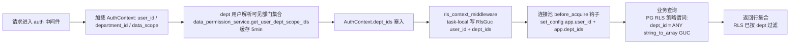

# 技术设计：RLS 表 Dept 语义实现

Feature Name: dept-data-scope-semantics
Updated: 2026-09-08
Status: DESIGN（依据 requirements.md 三项决策 D1=动态归属人部门 / D2=主+兼职+子部门 / D3=表冗余列+回填+写点）

## 描述

为 5 张 RLS 表（customers、suppliers、sales_orders、crm_lead、crm_opportunity）补齐 dept 数据范围语义，使部门经理（约 10 个 dept 角色）能查看本部门成员的数据行，同时消除 RLS 策略 self 级与应用层 dept 分支错位（created_by = department_id 的既有 bug）。

依据三项决策落地：
- 数据部门 = 数据归属人所在部门（动态，归属人转移时跟随）
- 可见部门集合 = 主部门 + 全部兼职部门 + 上述部门的全部子部门
- 实现载体 = 表冗余 `department_id` 列 + 回填迁移 + DB 触发器自动维护 + 写路径零侵入

## 架构



## 组件与接口

### 1. 数据模型层（迁移）

新增域迁移文件 `migration/src/domain/rls_dept/mod.rs`，注册进 `Migrator::migrations()`。`up()` 幂等执行：

```sql
-- A. 5 表加冗余 department_id 列（INTEGER，NULL=无部门归属/历史）
ALTER TABLE customers ADD COLUMN IF NOT EXISTS department_id INTEGER;
ALTER TABLE suppliers ADD COLUMN IF NOT EXISTS department_id INTEGER;
ALTER TABLE sales_orders ADD COLUMN IF NOT EXISTS department_id INTEGER;
ALTER TABLE crm_lead ADD COLUMN IF NOT EXISTS department_id INTEGER;
ALTER TABLE crm_opportunity ADD COLUMN IF NOT EXISTS department_id INTEGER;

-- B. 回填：按数据归属人反查 users.department_id
UPDATE customers c SET department_id = u.department_id FROM users u WHERE c.owner_id = u.id AND c.owner_id <> 0;
UPDATE crm_lead l SET department_id = u.department_id FROM users u WHERE l.owner_id = u.id;
UPDATE crm_opportunity o SET department_id = u.department_id FROM users u WHERE o.owner_id = u.id;
UPDATE suppliers s SET department_id = u.department_id FROM users u WHERE s.created_by = u.id;
UPDATE sales_orders s SET department_id = u.department_id FROM users u WHERE s.created_by = u.id;

-- C. 索引
CREATE INDEX IF NOT EXISTS idx_customers_department ON customers (department_id);
CREATE INDEX IF NOT EXISTS idx_suppliers_department ON suppliers (department_id);
CREATE INDEX IF NOT EXISTS idx_sales_orders_department ON sales_orders (department_id);
CREATE INDEX IF NOT EXISTS idx_crm_lead_department ON crm_lead (department_id);
CREATE INDEX IF NOT EXISTS idx_crm_opportunity_department ON crm_opportunity (department_id);

-- D. 触发器：BEFORE INSERT OR UPDATE OF owner_id/created_by 自动维护 department_id
CREATE OR REPLACE FUNCTION sync_data_department() RETURNS TRIGGER LANGUAGE plpgsql AS $$
BEGIN
  NEW.department_id := (SELECT department_id FROM users WHERE id = COALESCE(NEW.owner_id, NEW.created_by));
  RETURN NEW;
END $$;
CREATE TRIGGER trg_customers_dept BEFORE INSERT OR UPDATE OF owner_id ON customers FOR EACH ROW EXECUTE FUNCTION sync_data_department();
CREATE TRIGGER trg_suppliers_dept BEFORE INSERT OR UPDATE OF created_by ON suppliers FOR EACH ROW EXECUTE FUNCTION sync_data_department();
CREATE TRIGGER trg_sales_orders_dept BEFORE INSERT OR UPDATE OF created_by ON sales_orders FOR EACH ROW EXECUTE FUNCTION sync_data_department();
CREATE TRIGGER trg_crm_lead_dept BEFORE INSERT OR UPDATE OF owner_id ON crm_lead FOR EACH ROW EXECUTE FUNCTION sync_data_department();
CREATE TRIGGER trg_crm_opportunity_dept BEFORE INSERT OR UPDATE OF owner_id ON crm_opportunity FOR EACH ROW EXECUTE FUNCTION sync_data_department();

-- E. STABLE 函数：语句级求值一次，避免每行 string_to_array 开销
CREATE OR REPLACE FUNCTION app_dept_ids() RETURNS int[] STABLE LANGUAGE sql AS $$
  SELECT COALESCE(string_to_array(current_setting('app.dept_ids', true), ',')::int[], ARRAY[]::int[])
$$;

-- F. 重写 5 表 RLS 策略（DROP 旧 + CREATE 新）
DROP POLICY IF EXISTS customers_isolation ON customers;
CREATE POLICY customers_isolation ON customers FOR ALL
  USING ( current_setting('app.user_id', true) IS NULL
          OR owner_id = current_setting('app.user_id', true)::int
          OR owner_id = 0
          OR department_id = ANY(app_dept_ids()) )
  WITH CHECK ( current_setting('app.user_id', true) IS NULL
               OR owner_id = current_setting('app.user_id', true)::int
               OR owner_id = 0
               OR department_id = ANY(app_dept_ids()) );
-- suppliers / sales_orders 同形态（created_by IS NULL 历史分支 + created_by 匹配 + department_id ANY）
-- crm_lead / crm_opportunity 同形态（公海分支用 OR lead_status = 'pool' / opportunity_status = 'pool'）
```

迁移注册：`migration/src/domain/mod.rs` 加 `pub mod rls_dept;`；`migration/src/lib.rs` `migrations()` vec 末尾追加 `Box::new(domain::rls_dept::Migration)`（顺序必须在 finance 之后）。

### 2. RLS 上下文层（rls_context.rs）

```rust
pub struct RlsGuc {
    pub user_id: i32,
    pub dept_ids: Option<Arc<String>>, // 逗号分隔；None = self 语义
}

tokio::task_local! { pub static RLS_GUC: Option<RlsGuc>; }
```

- `rls_context_middleware`：从 AuthContext 读 `dept_ids`（auth 已加载），非 admin 用户构造 `RlsGuc` 写入 task-local。
- `install_rls_pool_hooks` 的 `before_acquire` / `after_connect` 钩子：`set_config('app.user_id', ..., false)` 与 `set_config('app.dept_ids', ..., false)` 单条 SQL 双 set_config；无上下文 RESET 双 GUC。
- self 用户：dept_ids=None → 钩子只设 user_id → 策略 `department_id = ANY(string_to_array(NULL))` 返回 NULL → 走 self 分支 ✓。
- admin 用户：不进作用域 → 双 GUC 均 NULL → fail-open ✓。

### 3. 认证上下文层（auth.rs / auth_context.rs）

- `AuthContext` 新增字段：`dept_ids: Option<Arc<Vec<i32>>>`。
- `auth_middleware`（auth.rs:301-320 区域）：在查 role/user 之后，若 `data_scope = "dept"` 调 `data_permission_service.get_user_dept_scope_ids_cached(user_id)` 解析可见部门集合并写入 AuthContext；self/all 不解析（None）。

### 4. 部门范围解析层（data_permission_service.rs）

- `get_user_dept_scope_ids(user_id)` 已实现（含主+兼职+子树），新增缓存包装 `get_user_dept_scope_ids_cached`：
  - key = `dept_scope:{user_id}`，TTL 5 分钟（对齐 PERMISSION_CACHE 模式，可环境变量 `DEPT_SCOPE_TTL_MINS`）。
  - 部门变更失效：`assign_user_departments`（department_service.rs:286）追加缓存删除；`create/update department` 的 parent_id 变更触发批量失效（部门树结构调整低频，可接受 TTL 兜底）。

### 5. 应用层 dept 过滤修复（data_scope.rs）

- `build_data_scope_condition` 的 Dept 分支修正为子查询：`owner_column.in_subquery(SELECT id FROM users WHERE department_id IN (可见部门集合))`——用现有 `DataScopeContext.department_id`（单值）已不够，需扩展 context 携带 `dept_ids: Vec<i32>`。
- 6 个调用点（customer_ops/crud.rs:110、customer_ops/query.rs:69、crm/lead.rs:136、crm/opp.rs:136、supplier_service.rs:200、so/order_query.rs:122）传新列：`customer::Column::DepartmentId` 等（迁移加列后 Entity 自动有此 Column）。
- 兼容性：RLS 已过滤的情况下应用层同口径过滤是深度防御（冗余但安全）。

## 数据模型

```
AuthContext {
    user_id: i32,
    username: String,
    role_id: Option<i32>,
    department_id: Option<i32>,      // 主部门单值（auth.rs:319 已加载）
    data_scope: Option<String>,
    dept_ids: Option<Arc<Vec<i32>>>,  // 新增：可见部门集合（仅 dept 用户加载）
}

RlsGuc {                              // task-local
    user_id: i32,
    dept_ids: Option<Arc<String>>,    // 逗号分隔串
}
```

PG 侧冗余列：5 表新增 `department_id INTEGER`（可空），由触发器自动维护，应用代码不直接写。

## 正确性属性

1. **数据部门不变式**：5 表任意行的 `department_id` 恒等于该行数据归属人（owner_id 或 created_by 指向的 user）的 `users.department_id`。由 DB 触发器在 INSERT/UPDATE OF owner_id,created_by 时强制。
2. **可见集合完整性**：dept 用户的可见部门集合必然包含其主部门（来自 users.department_id），即使 user_departments 为空。
3. **RLS 与应用层口径一致**：两者对同一用户、同一表返回的行集合等价（交集=各自结果）。
4. **公海可见性**：customers `owner_id=0`、crm_lead `lead_status='pool'`、crm_opportunity `opportunity_status='pool'`、suppliers/sales_orders `created_by IS NULL` 的行对所有已认证用户可见。
5. **降级安全**：可见部门集合解析失败 → 退化为 self（user_id 匹配）+ warn；GUC 未设置 → 策略 fail-open + 应用层兜底。
6. **转移跟随**：owner_id/created_by UPDATE 触发器重算 department_id → 转移后新经理立即可见、原经理失去可见性。

## 错误处理

| 场景 | 处理 |
|------|------|
| `get_user_dept_scope_ids_cached` 查询失败 | 返回空集合 → dept 用户退化为「无可见部门」→ 仅本用户数据 + 公海；warn 日志 |
| 部门集合超大（>100 ID） | GUC 字符串长度可控（PG custom GUC 上限 1GB）；性能策略走 `app_dept_ids()` STABLE 函数语句级求值 |
| 触发器中 users 查不到归属人 | department_id 置 NULL → 该行视为无部门数据，dept 用户不可见、self 用户若恰为 owner 仍可见 |
| 迁移在已部署库执行 | DROP POLICY IF EXISTS + CREATE 幂等；ALTER ADD COLUMN IF NOT EXISTS；触发器 CREATE OR REPLACE + DROP TRIGGER IF EXISTS |
| 连接被超时 drop | 双 GUC 由下次借出钩子 RESET，无残留 |

## 测试策略

1. **迁移单测（PG）**：新建迁移后断言 5 表有 department_id 列、触发器存在、回填后样本行的 department_id 与 users 一致。
2. **RLS 策略测试（PG，扩展 rls_context_test.rs）**：
   - self 用户：仅本人行 + 公海行可见。
   - dept 用户：本部门（主+兼职+子部门）成员的行 + 本人行 + 公海行可见；跨部门行不可见。
   - 转移后：原 owner 部门经理失去可见、新 owner 部门经理获得可见（触发器重算 department_id）。
   - 无部门 dept 用户：退化为 self。
3. **触发器验证**：直接 UPDATE owner_id 后断言 department_id 自动跟随（D1 动态语义锚点）。
4. **应用层对齐测试**：data_scope.rs 单测扩展——dept 分支返回与 RLS 一致的行集合。
5. **CI 兼容**：sqlite 路径不建触发器（PG 专属），task-local 机制无副作用；新迁移仅 PG 库执行。

## 实施 Sequencing（关键）

部署顺序避免窗口期锁出：

1. **先发布迁移**（新策略带 dept 分支 + app_dept_ids 函数）：旧后端不设置 app.dept_ids GUC → `app_dept_ids()` 返回空数组 → `department_id = ANY('{}')` = false → dept 用户退化为 self + 公海（与方案①行为等价，安全降级）。
2. **再发布新后端**（RLS 中间件加载 dept_ids）：dept 用户恢复部门视角。
3. 回滚：迁移 down 恢复旧策略（DROP 新 POLICY + 重建 finance 原策略）。

## 风险与缓解

- **触发器性能**：每行 INSERT/UPDATE 一次 users PK 点查（已索引），开销可控；批量导入（import.rs）放大但 users PK 查询廉价。
- **`app_dept_ids()` STABLE 求值**：PG 对 STABLE 函数在 RLS 谓词中的求值时机——若 planner 不内联则每行调用一次（string_to_array 解析 GUC 字符串，开销小）；对大表全表扫描（BI）有放大，必要时改用 GUC 直接 `= ANY(string_to_array(...))` inline 形式（A/B 测试择优）。
- **部门变更缓存滞后**：TTL 5 分钟内 dept 视角可能滞后于部门调整；assign_user_departments 主动失效缓解，剩余窗口可接受（部门调整低频）。
- **公海状态列统一**：crm_lead 用 lead_status、crm_opportunity 用 opportunity_status；策略谓词按表差异处理。
- **D1 动态 vs 历史 owner**：转移后 department_id 跟随新 owner（D1 决策）；历史 owner 部门的经理失去可见——符合「部门经理管本部门现在的数据」语义。

## 引用

- requirements.md（本目录）
- backend/src/middleware/rls_context.rs（现有 task-local + 钩子机制）
- backend/src/middleware/auth.rs:301-320（AuthContext 加载逻辑扩展点）
- backend/src/services/data_permission_service.rs:306（get_user_dept_scope_ids 复用）
- backend/migration/src/domain/finance/mod.rs:108-180（原 RLS 策略，新迁移在其后注册）
- backend/src/utils/data_scope.rs:64-90（dept 分支 bug 修复点）
- backend/src/services/init_service_ops/role.rs（角色 data_scope 分布）
