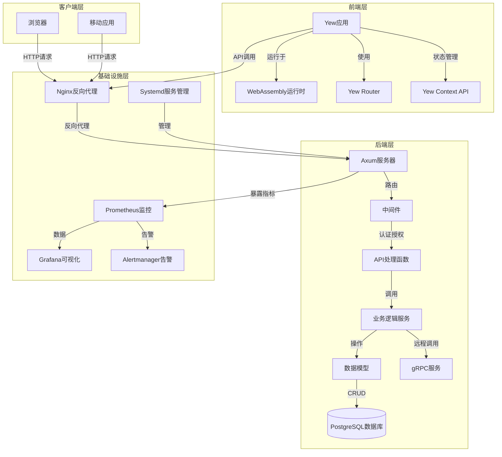
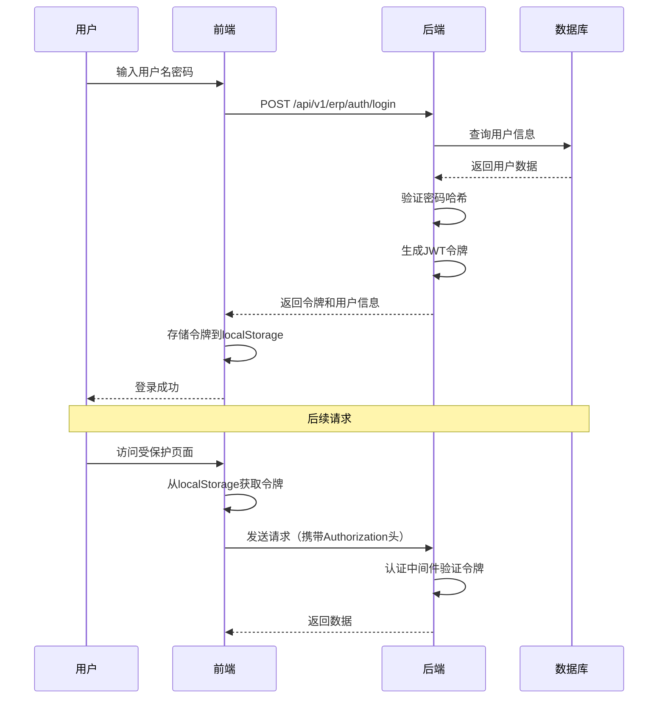

# 秉羲管理系统 - 超级完整项目文档

## 文档信息

| 项目 | 信息 |
|------|------|
| **文档版本** | 2.0.0 |
| **最后更新** | 2026-04-04 |
| **文档状态** | 完整 |
| **项目名称** | 秉羲管理系统 |
| **开发团队** | 秉羲团队 |

---

## 目录

1. [项目概述](#1-项目概述)
2. [技术架构](#2-技术架构)
3. [项目结构](#3-项目结构)
4. [核心功能模块](#4-核心功能模块)
5. [API接口文档](#5-api接口文档)
6. [数据库设计](#6-数据库设计)
7. [前端应用](#7-前端应用)
8. [部署指南](#8-部署指南)
9. [开发指南](#9-开发指南)
10. [测试指南](#10-测试指南)
11. [运维指南](#11-运维指南)
12. [故障排查](#12-故障排查)
13. [性能优化](#13-性能优化)
14. [安全机制](#14-安全机制)
15. [监控与告警](#15-监控与告警)
16. [业务流程](#16-业务流程)
17. [常见问题](#17-常见问题)
18. [项目历史](#18-项目历史)
19. [附录](#19-附录)

---

## 1. 项目概述

### 1.1 项目简介

秉羲管理系统是一个基于Rust语言开发的企业资源规划（ERP）系统，专为面料行业定制，提供完整的企业管理功能。系统采用现代化的前后端分离架构，具有高性能、可扩展、行业特色明显等特点。

### 1.2 项目定位

| 维度 | 描述 |
|------|------|
| **目标行业** | 面料生产与贸易企业 |
| **系统规模** | 中大型企业级应用 |
| **核心价值** | 提供完整的面料行业管理解决方案，优化业务流程，提高管理效率 |
| **技术定位** | 高性能、高安全性、高可扩展性的现代化ERP系统 |

### 1.3 系统特点

- **高性能**：基于Rust语言开发，性能优异，资源占用低
- **行业特色**：支持面料行业特殊需求，如批次管理、双计量单位自动换算等
- **模块化设计**：清晰的模块划分，易于扩展和维护
- **前后端分离**：现代化的前后端分离架构，提供良好的用户体验
- **完整功能**：涵盖企业管理的各个方面，从采购到销售，从库存到财务
- **多租户支持**：可支持多个企业或部门使用同一系统
- **安全可靠**：完善的认证授权机制，数据安全保障
- **易于部署**：提供完整的部署脚本和监控方案

### 1.4 功能全景图

系统包含25+个核心功能模块，覆盖企业管理的各个方面：

```
秉羲管理系统
├── 基础管理
│   ├── 用户与权限管理
│   ├── 部门管理
│   ├── 角色管理
│   └── 系统初始化
├── 产品管理
│   ├── 产品管理
│   ├── 产品分类
│   ├── 产品色号
│   └── 产品编码映射
├── 仓库管理
│   ├── 仓库管理
│   ├── 库位管理
│   └── 库存管理
├── 库存管理
│   ├── 库存查询
│   ├── 库存调拨
│   ├── 库存盘点
│   ├── 库存调整
│   ├── 库存预留
│   └── 匹数管理
├── 销售管理
│   ├── 销售订单
│   ├── 销售合同
│   ├── 销售价格
│   ├── 销售分析
│   ├── 面料销售订单
│   └── 销售交货
├── 采购管理
│   ├── 采购订单
│   ├── 采购合同
│   ├── 采购收货
│   ├── 采购退货
│   ├── 采购价格
│   ├── 采购检验
│   └── 采购合同执行
├── 供应商管理
│   ├── 供应商管理
│   ├── 供应商分类
│   ├── 供应商评估
│   ├── 供应商资格
│   ├── 供应商黑名单
│   └── 供应商产品
├── 客户管理
│   ├── 客户管理
│   ├── 客户信用
│   └── CRM
├── 财务管理
│   ├── 总账管理
│   ├── 科目管理
│   ├── 凭证管理
│   ├── 应付账款
│   ├── 应收账款
│   ├── 财务分析
│   ├── 发票管理
│   ├── 付款管理
│   └── 账户余额
├── 生产管理
│   ├── 批次管理
│   ├── 染色批次
│   ├── 染色配方
│   ├── 缸号管理
│   ├── 坯布管理
│   └── 匹号映射
├── 成本管理
│   ├── 成本归集
│   └── 成本分析
├── 辅助核算
│   ├── 辅助核算维度
│   ├── 辅助核算记录
│   └── 辅助核算汇总
├── 业务追溯
│   ├── 五维度查询
│   ├── 业务追溯链
│   ├── 数据快照
│   └── 批次追踪日志
├── 预算管理
│   ├── 预算计划
│   ├── 预算执行
│   └── 预算调整
├── 固定资产
│   ├── 固定资产管理
│   └── 固定资产处置
├── 资金管理
│   ├── 资金账户
│   ├── 资金管理
│   └── 资金转账记录
├── 质量管理
│   ├── 质量标准
│   ├── 质量检验
│   ├── 质量检验记录
│   └── 不合格品管理
├── CRM
│   ├── 销售线索
│   └── 销售机会
├── OA
│   └── 公告管理
├── BPM流程
│   ├── 流程定义
│   ├── 流程实例
│   └── 流程任务
├── 报表
│   └── 报表定义
├── 日志
│   ├── API访问日志
│   ├── 登录日志
│   ├── 系统日志
│   └── 操作日志
├── 仪表盘
│   └── 数据可视化
└── 系统管理
    ├── 系统初始化
    ├── 系统更新
    └── 系统版本
```

---

## 2. 技术架构

### 2.1 技术栈详解

#### 2.1.1 后端技术栈

| 技术 | 版本 | 用途 | 来源 |
|------|------|------|------|
| **Rust** | 2021 | 主要开发语言 | [backend/Cargo.toml](file:///workspace/backend/Cargo.toml#L1-L4) |
| **Axum** | 0.7 | Web框架 | [backend/Cargo.toml](file:///workspace/backend/Cargo.toml#L10) |
| **Tokio** | 1.0 | 异步运行时 | [backend/Cargo.toml](file:///workspace/backend/Cargo.toml#L17) |
| **PostgreSQL** | 14+ | 数据库 | [backend/.env.example](file:///workspace/backend/.env.example) |
| **SeaORM** | 1.0 | ORM框架 | [backend/Cargo.toml](file:///workspace/backend/Cargo.toml#L20) |
| **SQLx** | 0.8 | 数据库驱动 | [backend/Cargo.toml](file:///workspace/backend/Cargo.toml#L21) |
| **JWT** | 9.0 | 认证机制 | [backend/Cargo.toml](file:///workspace/backend/Cargo.toml#L33) |
| **Argon2** | 0.5 | 密码哈希 | [backend/Cargo.toml](file:///workspace/backend/Cargo.toml#L28) |
| **gRPC** | 0.12 | 服务间通信 | [backend/Cargo.toml](file:///workspace/backend/Cargo.toml#L55) |
| **Tonic** | 0.12 | gRPC框架 | [backend/Cargo.toml](file:///workspace/backend/Cargo.toml#L55) |
| **OpenAPI** | 5.x | API文档 | [backend/Cargo.toml](file:///workspace/backend/Cargo.toml#L88) |
| **Utoipa** | 5.x | OpenAPI生成 | [backend/Cargo.toml](file:///workspace/backend/Cargo.toml#L88) |
| **Prometheus** | 0.13 | 监控指标 | [backend/Cargo.toml](file:///workspace/backend/Cargo.toml#L70) |
| **Tracing** | 0.1 | 日志系统 | [backend/Cargo.toml](file:///workspace/backend/Cargo.toml#L44) |
| **Serde** | 1.0 | 序列化 | [backend/Cargo.toml](file:///workspace/backend/Cargo.toml#L24) |
| **Chrono** | 0.4 | 时间处理 | [backend/Cargo.toml](file:///workspace/backend/Cargo.toml#L49) |
| **Rust Decimal** | 1.0 | 小数处理 | [backend/Cargo.toml](file:///workspace/backend/Cargo.toml#L52) |
| **Rust XLSXWriter** | 0.58 | Excel处理 | [backend/Cargo.toml](file:///workspace/backend/Cargo.toml#L76) |
| **Validator** | 0.16 | 数据验证 | [backend/Cargo.toml](file:///workspace/backend/Cargo.toml#L36) |
| **Thiserror** | 1.0 | 错误处理 | [backend/Cargo.toml](file:///workspace/backend/Cargo.toml#L60) |
| **Anyhow** | 1.0 | 错误处理 | [backend/Cargo.toml](file:///workspace/backend/Cargo.toml#L61) |
| **Reqwest** | 0.12 | HTTP客户端 | [backend/Cargo.toml](file:///workspace/backend/Cargo.toml#L64) |
| **Config** | 0.14 | 配置管理 | [backend/Cargo.toml](file:///workspace/backend/Cargo.toml#L40) |
| **Dotenvy** | 0.15 | 环境变量 | [backend/Cargo.toml](file:///workspace/backend/Cargo.toml#L41) |

#### 2.1.2 前端技术栈

| 技术 | 版本 | 用途 | 来源 |
|------|------|------|------|
| **Yew** | 0.21 | Web框架 | [frontend/Cargo.toml](file:///workspace/frontend/Cargo.toml#L9) |
| **Rust WebAssembly** | - | 前端运行环境 | [frontend/Cargo.toml](file:///workspace/frontend/Cargo.toml) |
| **Yew Router** | 0.18 | 前端路由 | [frontend/Cargo.toml](file:///workspace/frontend/Cargo.toml#L10) |
| **Gloo Net** | 0.4 | HTTP客户端 | [frontend/Cargo.toml](file:///workspace/frontend/Cargo.toml#L28) |
| **Gloo** | 0.10 | 工具库 | [frontend/Cargo.toml](file:///workspace/frontend/Cargo.toml#L27) |
| **Serde** | 1.0 | 序列化 | [frontend/Cargo.toml](file:///workspace/frontend/Cargo.toml#L24) |
| **Chrono** | 0.4 | 时间处理 | [frontend/Cargo.toml](file:///workspace/frontend/Cargo.toml#L31) |
| **Thiserror** | 1.0 | 错误处理 | [frontend/Cargo.toml](file:///workspace/frontend/Cargo.toml#L32) |
| **Tracing** | 0.1 | 日志系统 | [frontend/Cargo.toml](file:///workspace/frontend/Cargo.toml#L33) |
| **Web Sys** | 0.3 | Web API绑定 | [frontend/Cargo.toml](file:///workspace/frontend/Cargo.toml#L14) |
| **JS Sys** | 0.3 | JS API绑定 | [frontend/Cargo.toml](file:///workspace/frontend/Cargo.toml#L23) |
| **WASM Bindgen** | 0.2 | WASM绑定 | [frontend/Cargo.toml](file:///workspace/frontend/Cargo.toml#L11) |

#### 2.1.3 部署与监控技术栈

| 技术 | 版本 | 用途 | 来源 |
|------|------|------|------|
| **Systemd** | - | 服务管理 | [deploy/bingxi-backend.service](file:///workspace/deploy/bingxi-backend.service) |
| **Nginx** | 1.18+ | 反向代理 | [deploy/nginx.conf](file:///workspace/deploy/nginx.conf) |
| **Prometheus** | 2.40+ | 指标收集 | [monitoring/prometheus/prometheus.yml](file:///workspace/monitoring/prometheus/prometheus.yml) |
| **Grafana** | 9.0+ | 指标可视化 | [monitoring/grafana/dashboards/bingxi-erp-overview.json](file:///workspace/monitoring/grafana/dashboards/bingxi-erp-overview.json) |
| **Alertmanager** | 0.25+ | 告警管理 | [monitoring/alertmanager/alertmanager.yml](file:///workspace/monitoring/alertmanager/alertmanager.yml) |

### 2.2 架构设计

#### 2.2.1 整体架构图



#### 2.2.2 层次架构

系统采用经典的三层架构：

```
┌─────────────────────────────────────────┐
│         表现层 (Presentation)           │
│  - Yew WebAssembly 前端                 │
│  - 响应式UI组件                        │
│  - 路由导航                            │
└─────────────────────┬───────────────────┘
                      │ HTTP/REST API
┌─────────────────────▼───────────────────┐
│         业务层 (Business)               │
│  - Axum Web 框架                        │
│  - Handler 处理函数                     │
│  - Service 业务逻辑                     │
│  - 中间件 (认证、日志、限流等)          │
└─────────────────────┬───────────────────┘
                      │ ORM/DAO
┌─────────────────────▼───────────────────┐
│         数据层 (Data)                   │
│  - SeaORM ORM 框架                      │
│  - PostgreSQL 数据库                    │
│  - 数据模型定义                         │
└─────────────────────────────────────────┘
```

#### 2.2.3 核心模块关系

| 模块 | 主要职责 | 依赖关系 | 调用链 |
|------|---------|----------|--------|
| **认证模块** | 用户登录、注销、令牌管理 | 依赖用户服务 | `auth_handler.rs → auth_service.rs → user_service.rs` |
| **用户模块** | 用户CRUD、角色管理 | 依赖数据库 | `user_handler.rs → user_service.rs → user_model.rs` |
| **库存模块** | 库存管理、调拨、盘点 | 依赖产品模块 | `inventory_stock_handler.rs → inventory_stock_service.rs → product_service.rs` |
| **销售模块** | 销售订单、合同管理 | 依赖客户模块 | `sales_order_handler.rs → sales_service.rs → customer_service.rs` |
| **采购模块** | 采购订单、收货管理 | 依赖供应商模块 | `purchase_order_handler.rs → purchase_order_service.rs → supplier_service.rs` |
| **财务模块** | 凭证、发票管理 | 依赖销售/采购模块 | `voucher_handler.rs → voucher_service.rs → sales_service.rs` |
| **批次模块** | 面料批次、色号管理 | 依赖产品模块 | `batch_handler.rs → batch_service.rs → product_service.rs` |

---

## 3. 项目结构

### 3.1 完整目录结构

```
/workspace
├── backend/                          # 后端应用
│   ├── src/                          # 源代码
│   │   ├── config/                   # 配置管理
│   │   │   ├── mod.rs
│   │   │   └── settings.rs          # 应用配置
│   │   ├── database/                 # 数据库连接
│   │   │   ├── migration/            # 数据库迁移
│   │   │   │   ├── 202403230001_create_budget_plans.sql
│   │   │   │   ├── 202403230002_create_supplier_evaluation_records.sql
│   │   │   │   ├── 202403230003_create_financial_analysis_results.sql
│   │   │   │   ├── 202403230004_create_budget_executions.sql
│   │   │   │   └── 202403230005_create_account_balances.sql
│   │   │   ├── mod.rs
│   │   │   └── sqlx_pool.rs         # SQLx连接池
│   │   ├── grpc/                     # gRPC服务
│   │   │   ├── proto/
│   │   │   │   └── mod.rs
│   │   │   ├── management_services.rs
│   │   │   ├── mod.rs
│   │   │   ├── new_services.rs
│   │   │   └── service.rs
│   │   ├── handlers/                 # API处理函数 (60+个)
│   │   │   ├── mod.rs
│   │   │   ├── auth_handler.rs
│   │   │   ├── user_handler.rs
│   │   │   ├── role_handler.rs
│   │   │   ├── department_handler.rs
│   │   │   ├── product_handler.rs
│   │   │   ├── product_category_handler.rs
│   │   │   ├── warehouse_handler.rs
│   │   │   ├── inventory_stock_handler.rs
│   │   │   ├── inventory_transfer_handler.rs
│   │   │   ├── inventory_count_handler.rs
│   │   │   ├── inventory_adjustment_handler.rs
│   │   │   ├── sales_order_handler.rs
│   │   │   ├── sales_fabric_order_handler.rs
│   │   │   ├── sales_contract_handler.rs
│   │   │   ├── sales_price_handler.rs
│   │   │   ├── sales_analysis_handler.rs
│   │   │   ├── purchase_order_handler.rs
│   │   │   ├── purchase_contract_handler.rs
│   │   │   ├── purchase_receipt_handler.rs
│   │   │   ├── purchase_return_handler.rs
│   │   │   ├── purchase_inspection_handler.rs
│   │   │   ├── purchase_price_handler.rs
│   │   │   ├── supplier_handler.rs
│   │   │   ├── supplier_evaluation_handler.rs
│   │   │   ├── customer_handler.rs
│   │   │   ├── customer_credit_handler.rs
│   │   │   ├── voucher_handler.rs
│   │   │   ├── account_subject_handler.rs
│   │   │   ├── finance_invoice_handler.rs
│   │   │   ├── finance_payment_handler.rs
│   │   │   ├── ap_invoice_handler.rs
│   │   │   ├── ap_payment_handler.rs
│   │   │   ├── ap_payment_request_handler.rs
│   │   │   ├── ap_reconciliation_handler.rs
│   │   │   ├── ap_verification_handler.rs
│   │   │   ├── ap_report_handler.rs
│   │   │   ├── ar_invoice_handler.rs
│   │   │   ├── assist_accounting_handler.rs
│   │   │   ├── business_trace_handler.rs
│   │   │   ├── five_dimension_handler.rs
│   │   │   ├── budget_management_handler.rs
│   │   │   ├── fixed_asset_handler.rs
│   │   │   ├── fund_management_handler.rs
│   │   │   ├── quality_standard_handler.rs
│   │   │   ├── quality_inspection_handler.rs
│   │   │   ├── cost_collection_handler.rs
│   │   │   ├── financial_analysis_handler.rs
│   │   │   ├── batch_handler.rs
│   │   │   ├── batch_new_handler.rs
│   │   │   ├── dye_batch_handler.rs
│   │   │   ├── dye_recipe_handler.rs
│   │   │   ├── greige_fabric_handler.rs
│   │   │   ├── dual_unit_converter_handler.rs
│   │   │   ├── dashboard_handler.rs
│   │   │   ├── init_handler.rs
│   │   │   ├── system_update_handler.rs
│   │   │   ├── health_handler.rs
│   │   │   └── base_data_handler.rs
│   │   ├── middleware/               # 中间件
│   │   │   ├── mod.rs
│   │   │   ├── auth.rs                # 认证中间件
│   │   │   ├── auth_context.rs
│   │   │   ├── logger_middleware.rs   # 日志中间件
│   │   │   ├── metrics.rs             # 指标中间件
│   │   │   ├── operation_log.rs       # 操作日志中间件
│   │   │   ├── permission.rs          # 权限中间件
│   │   │   ├── rate_limit.rs          # 限流中间件
│   │   │   ├── rate_limiter.rs
│   │   │   └── request_validator.rs   # 请求验证中间件
│   │   ├── models/                   # 数据模型 (140+个)
│   │   │   ├── mod.rs
│   │   │   ├── user.rs
│   │   │   ├── role.rs
│   │   │   ├── role_permission.rs
│   │   │   ├── department.rs
│   │   │   ├── product.rs
│   │   │   ├── product_category.rs
│   │   │   ├── product_color.rs
│   │   │   ├── warehouse.rs
│   │   │   ├── inventory_stock.rs
│   │   │   ├── inventory_transfer.rs
│   │   │   ├── inventory_transfer_item.rs
│   │   │   ├── inventory_count.rs
│   │   │   ├── inventory_count_item.rs
│   │   │   ├── inventory_adjustment.rs
│   │   │   ├── inventory_adjustment_item.rs
│   │   │   ├── inventory_reservation.rs
│   │   │   ├── inventory_transaction.rs
│   │   │   ├── inventory_piece.rs
│   │   │   ├── sales_order.rs
│   │   │   ├── sales_order_item.rs
│   │   │   ├── sales_contract.rs
│   │   │   ├── sales_price.rs
│   │   │   ├── sales_analysis.rs
│   │   │   ├── sales_delivery.rs
│   │   │   ├── sales_delivery_item.rs
│   │   │   ├── purchase_order.rs
│   │   │   ├── purchase_order_item.rs
│   │   │   ├── purchase_contract.rs
│   │   │   ├── purchase_contract_execution.rs
│   │   │   ├── purchase_receipt.rs
│   │   │   ├── purchase_receipt_item.rs
│   │   │   ├── purchase_return.rs
│   │   │   ├── purchase_inspection.rs
│   │   │   ├── purchase_price.rs
│   │   │   ├── supplier.rs
│   │   │   ├── supplier_category.rs
│   │   │   ├── supplier_contact.rs
│   │   │   ├── supplier_evaluation.rs
│   │   │   ├── supplier_evaluation_record.rs
│   │   │   ├── supplier_grade.rs
│   │   │   ├── supplier_qualification.rs
│   │   │   ├── supplier_blacklist.rs
│   │   │   ├── supplier_product.rs
│   │   │   ├── supplier_product_color.rs
│   │   │   ├── product_supplier_mapping.rs
│   │   │   ├── customer.rs
│   │   │   ├── customer_credit.rs
│   │   │   ├── voucher.rs
│   │   │   ├── voucher_item.rs
│   │   │   ├── account_subject.rs
│   │   │   ├── account_balance.rs
│   │   │   ├── accounting_period.rs
│   │   │   ├── finance_invoice.rs
│   │   │   ├── finance_payment.rs
│   │   │   ├── ap_invoice.rs
│   │   │   ├── ap_payment.rs
│   │   │   ├── ap_payment_request.rs
│   │   │   ├── ap_payment_request_item.rs
│   │   │   ├── ap_reconciliation.rs
│   │   │   ├── ap_verification.rs
│   │   │   ├── ap_verification_item.rs
│   │   │   ├── ar_invoice.rs
│   │   │   ├── ar_collection.rs
│   │   │   ├── ar_mod.rs
│   │   │   ├── assist_accounting_dimension.rs
│   │   │   ├── assist_accounting_record.rs
│   │   │   ├── assist_accounting_summary.rs
│   │   │   ├── business_trace.rs
│   │   │   ├── business_trace_chain.rs
│   │   │   ├── business_trace_snapshot.rs
│   │   │   ├── business_trace_view.rs
│   │   │   ├── business_trace_assist_link.rs
│   │   │   ├── five_dimension.rs
│   │   │   ├── budget_management.rs
│   │   │   ├── budget_plan.rs
│   │   │   ├── budget_execution.rs
│   │   │   ├── budget_adjustment.rs
│   │   │   ├── fixed_asset.rs
│   │   │   ├── fixed_asset_disposal.rs
│   │   │   ├── fund_management.rs
│   │   │   ├── fund_account.rs
│   │   │   ├── fund_transfer_record.rs
│   │   │   ├── quality_standard.rs
│   │   │   ├── quality_inspection.rs
│   │   │   ├── quality_inspection_record.rs
│   │   │   ├── unqualified_product.rs
│   │   │   ├── cost_collection.rs
│   │   │   ├── cost_analysis.rs
│   │   │   ├── cost_mod.rs
│   │   │   ├── financial_analysis.rs
│   │   │   ├── financial_analysis_result.rs
│   │   │   ├── batch_dye_lot.rs
│   │   │   ├── batch_trace_log.rs
│   │   │   ├── dye_batch.rs
│   │   │   ├── dye_lot_mapping.rs
│   │   │   ├── dye_recipe.rs
│   │   │   ├── greige_fabric.rs
│   │   │   ├── product_code_mapping.rs
│   │   │   ├── color_code_mapping.rs
│   │   │   ├── piece_mapping.rs
│   │   │   ├── location.rs
│   │   │   ├── bpm_process_definition.rs
│   │   │   ├── bpm_process_instance.rs
│   │   │   ├── bpm_task.rs
│   │   │   ├── crm_lead.rs
│   │   │   ├── crm_opportunity.rs
│   │   │   ├── oa_announcement.rs
│   │   │   ├── log_api_access.rs
│   │   │   ├── log_login.rs
│   │   │   ├── log_system.rs
│   │   │   ├── operation_log.rs
│   │   │   ├── report_definition.rs
│   │   │   ├── system_version.rs
│   │   │   ├── dto.rs
│   │   │   └── models
│   │   ├── routes/                   # 路由配置
│   │   │   └── mod.rs
│   │   ├── services/                 # 业务逻辑服务 (60+个)
│   │   │   ├── mod.rs
│   │   │   ├── auth_service.rs
│   │   │   ├── user_service.rs
│   │   │   ├── role_service.rs
│   │   │   ├── role_permission_service.rs
│   │   │   ├── department_service.rs
│   │   │   ├── product_service.rs
│   │   │   ├── product_category_service.rs
│   │   │   ├── warehouse_service.rs
│   │   │   ├── inventory_stock_service.rs
│   │   │   ├── inventory_transfer_service.rs
│   │   │   ├── inventory_count_service.rs
│   │   │   ├── inventory_adjustment_service.rs
│   │   │   ├── inventory_reservation_service.rs
│   │   │   ├── sales_service.rs
│   │   │   ├── sales_order_service.rs
│   │   │   ├── sales_contract_service.rs
│   │   │   ├── sales_price_service.rs
│   │   │   ├── sales_analysis_service.rs
│   │   │   ├── purchase_order_service.rs
│   │   │   ├── purchase_contract_service.rs
│   │   │   ├── purchase_receipt_service.rs
│   │   │   ├── purchase_return_service.rs
│   │   │   ├── purchase_inspection_service.rs
│   │   │   ├── purchase_price_service.rs
│   │   │   ├── supplier_service.rs
│   │   │   ├── supplier_evaluation_service.rs
│   │   │   ├── customer_service.rs
│   │   │   ├── customer_credit_service.rs
│   │   │   ├── voucher_service.rs
│   │   │   ├── account_subject_service.rs
│   │   │   ├── finance_invoice_service.rs
│   │   │   ├── finance_payment_service.rs
│   │   │   ├── ap_invoice_service.rs
│   │   │   ├── ap_payment_service.rs
│   │   │   ├── ap_payment_request_service.rs
│   │   │   ├── ap_reconciliation_service.rs
│   │   │   ├── ap_verification_service.rs
│   │   │   ├── ap_report_service.rs
│   │   │   ├── ar_invoice_service.rs
│   │   │   ├── assist_accounting_service.rs
│   │   │   ├── business_trace_service.rs
│   │   │   ├── five_dimension_query_service.rs
│   │   │   ├── budget_management_service.rs
│   │   │   ├── fixed_asset_service.rs
│   │   │   ├── fund_management_service.rs
│   │   │   ├── quality_standard_service.rs
│   │   │   ├── quality_inspection_service.rs
│   │   │   ├── cost_collection_service.rs
│   │   │   ├── financial_analysis_service.rs
│   │   │   ├── batch_service.rs
│   │   │   ├── four_level_batch_service.rs
│   │   │   ├── dye_batch_service.rs
│   │   │   ├── dye_recipe_service.rs
│   │   │   ├── greige_fabric_service.rs
│   │   │   ├── dual_unit_converter_service.rs
│   │   │   ├── dashboard_service.rs
│   │   │   ├── init_service.rs
│   │   │   ├── system_update_service.rs
│   │   │   ├── metrics_service.rs
│   │   │   ├── operation_log_service.rs
│   │   │   ├── log_service.rs
│   │   │   ├── alert_service.rs
│   │   │   ├── base_data_service.rs
│   │   │   ├── p1p2_services.rs
│   │   │   ├── test_fixes.rs
│   │   │   └── tests/                 # 服务测试
│   │   │       ├── mod.rs
│   │   │       ├── auth_service_test.rs
│   │   │       ├── user_service_test.rs
│   │   │       ├── bpm_service_test.rs
│   │   │       ├── code_conversion_service_test.rs
│   │   │       ├── four_level_batch_service_test.rs
│   │   │       └── log_service_test.rs
│   │   ├── utils/                    # 工具函数
│   │   │   ├── mod.rs
│   │   │   ├── app_state.rs           # 应用状态
│   │   │   ├── cache.rs               # 缓存工具
│   │   │   ├── dual_unit_converter.rs # 双计量单位转换器
│   │   │   ├── error.rs               # 错误处理
│   │   │   ├── fabric_five_dimension.rs # 面料五维度
│   │   │   └── response.rs            # 响应封装
│   │   ├── lib.rs                     # 库入口
│   │   ├── main.rs                    # 应用入口
│   │   └── openapi.rs                 # OpenAPI文档
│   ├── database/                     # 数据库相关
│   ├── proto/                        # gRPC协议定义
│   │   └── bingxi.proto
│   ├── scripts/                      # 脚本
│   │   ├── performance_test_ab.sh     # ab性能测试
│   │   └── performance_test_wrk.sh    # wrk性能测试
│   ├── tests/                        # 测试文件 (10+个)
│   │   ├── api_test.rs
│   │   ├── auth_integration_test.rs
│   │   ├── cache_test.rs
│   │   ├── config_database_test.rs
│   │   ├── init_service_test.rs
│   │   ├── management_services_integration_test.rs
│   │   ├── rate_limit_test.rs
│   │   ├── unit_tests.rs
│   │   └── user_integration_test.rs
│   ├── docs/                         # 文档
│   │   └── postman_collection.json    # Postman集合
│   ├── logs/                         # 日志目录
│   │   ├── bingxi_backend.log.2026-03-22
│   │   └── bingxi_backend.log.2026-03-23
│   ├── Cargo.toml                    # 依赖管理
│   ├── Cargo.lock
│   ├── config.toml                   # 配置文件
│   ├── config.yaml
│   ├── .env.example                  # 环境变量示例
│   ├── build.rs                      # 构建脚本
│   ├── build.sh                      # 构建脚本
│   ├── build.bat
│   ├── check_build.bat
│   ├── deploy_verification.bat
│   ├── login.json
│   └── rustup-init.exe
├── frontend/                         # 前端应用
│   ├── src/                          # 源代码
│   │   ├── app/                      # 应用组件
│   │   │   └── mod.rs
│   │   ├── components/               # 通用组件
│   │   │   ├── mod.rs
│   │   │   ├── main_layout.rs        # 主布局
│   │   │   └── navigation.rs         # 导航组件
│   │   ├── models/                   # 数据模型
│   │   │   ├── mod.rs
│   │   │   ├── api_response.rs        # API响应
│   │   │   ├── auth.rs
│   │   │   ├── user.rs
│   │   │   ├── department.rs
│   │   │   ├── product.rs
│   │   │   ├── warehouse.rs
│   │   │   ├── inventory.rs
│   │   │   ├── inventory_adjustment.rs
│   │   │   ├── inventory_count.rs
│   │   │   ├── inventory_transfer.rs
│   │   │   ├── sales.rs
│   │   │   ├── sales_analysis.rs
│   │   │   ├── sales_contract.rs
│   │   │   ├── sales_price.rs
│   │   │   ├── purchase_contract.rs
│   │   │   ├── purchase_inspection.rs
│   │   │   ├── purchase_order.rs
│   │   │   ├── purchase_price.rs
│   │   │   ├── purchase_receipt.rs
│   │   │   ├── purchase_return.rs
│   │   │   ├── supplier.rs
│   │   │   ├── supplier_evaluation.rs
│   │   │   ├── customer.rs
│   │   │   ├── customer_credit.rs
│   │   │   ├── voucher.rs
│   │   │   ├── account_subject.rs
│   │   │   ├── finance_invoice.rs
│   │   │   ├── finance_payment.rs
│   │   │   ├── financial_analysis.rs
│   │   │   ├── five_dimension.rs
│   │   │   ├── fixed_asset.rs
│   │   │   ├── fund_management.rs
│   │   │   ├── budget_management.rs
│   │   │   ├── batch.rs
│   │   │   ├── dye_batch.rs
│   │   │   ├── dye_recipe.rs
│   │   │   ├── greige_fabric.rs
│   │   │   ├── dual_unit_converter.rs
│   │   │   ├── business_trace.rs
│   │   │   ├── assist_accounting.rs
│   │   │   ├── cost_collection.rs
│   │   │   ├── quality_inspection.rs
│   │   │   ├── ap_invoice.rs
│   │   │   ├── ap_payment.rs
│   │   │   ├── ap_payment_request.rs
│   │   │   ├── ap_reconciliation.rs
│   │   │   ├── ap_report.rs
│   │   │   ├── ap_verification.rs
│   │   │   ├── ar_invoice.rs
│   │   │   ├── fabric_order.rs
│   │   │   ├── init.rs
│   │   │   └── dashboard.rs
│   │   ├── pages/                    # 页面组件 (50+个)
│   │   │   ├── mod.rs
│   │   │   ├── login.rs              # 登录页面
│   │   │   ├── init.rs               # 初始化页面
│   │   │   ├── dashboard.rs          # 仪表盘
│   │   │   ├── user_list.rs          # 用户列表
│   │   │   ├── role_list.rs          # 角色列表
│   │   │   ├── department_list.rs    # 部门列表
│   │   │   ├── product_list.rs       # 产品列表
│   │   │   ├── product_category.rs   # 产品分类
│   │   │   ├── warehouse_list.rs     # 仓库列表
│   │   │   ├── inventory_stock.rs    # 库存查询
│   │   │   ├── inventory_transfer.rs # 库存调拨
│   │   │   ├── inventory_count.rs    # 库存盘点
│   │   │   ├── inventory_adjustment.rs # 库存调整
│   │   │   ├── sales_order.rs        # 销售订单
│   │   │   ├── fabric_order.rs       # 面料订单
│   │   │   ├── sales_contract.rs     # 销售合同
│   │   │   ├── sales_price.rs        # 销售价格
│   │   │   ├── sales_analysis.rs     # 销售分析
│   │   │   ├── purchase_order.rs     # 采购订单
│   │   │   ├── purchase_contract.rs  # 采购合同
│   │   │   ├── purchase_receipt.rs   # 采购收货
│   │   │   ├── purchase_return.rs    # 采购退货
│   │   │   ├── purchase_inspection.rs # 采购检验
│   │   │   ├── purchase_price.rs     # 采购价格
│   │   │   ├── supplier.rs           # 供应商
│   │   │   ├── supplier_evaluation.rs # 供应商评估
│   │   │   ├── customer.rs           # 客户
│   │   │   ├── customer_credit.rs    # 客户信用
│   │   │   ├── voucher.rs            # 凭证
│   │   │   ├── account_subject.rs    # 会计科目
│   │   │   ├── finance_invoice.rs    # 财务发票
│   │   │   ├── finance_payment.rs    # 财务付款
│   │   │   ├── ap_invoice.rs         # 应付发票
│   │   │   ├── ap_payment.rs         # 应付付款
│   │   │   ├── ap_payment_request.rs # 应付付款申请
│   │   │   ├── ap_reconciliation.rs  # 应付对账
│   │   │   ├── ap_verification.rs    # 应付核销
│   │   │   ├── ap_report.rs          # 应付报表
│   │   │   ├── ar_invoice.rs         # 应收发票
│   │   │   ├── assist_accounting.rs   # 辅助核算
│   │   │   ├── business_trace.rs      # 业务追溯
│   │   │   ├── five_dimension.rs     # 五维度查询
│   │   │   ├── budget_management.rs   # 预算管理
│   │   │   ├── fixed_asset.rs        # 固定资产
│   │   │   ├── fund_management.rs     # 资金管理
│   │   │   ├── dual_unit_converter.rs # 双计量单位转换
│   │   │   ├── cost_collection.rs     # 成本归集
│   │   │   ├── quality_inspection.rs  # 质量检验
│   │   │   ├── financial_analysis.rs  # 财务分析
│   │   │   ├── batch.rs              # 批次管理
│   │   │   ├── dye_batch.rs          # 染色批次
│   │   │   ├── dye_recipe.rs         # 染色配方
│   │   │   └── greige_fabric.rs      # 坯布管理
│   │   ├── services/                 # API服务 (40+个)
│   │   │   ├── mod.rs
│   │   │   ├── api.rs                # API基础服务
│   │   │   ├── auth.rs               # 认证服务
│   │   │   ├── user_service.rs
│   │   │   ├── department_service.rs
│   │   │   ├── product_service.rs
│   │   │   ├── warehouse_service.rs
│   │   │   ├── inventory_service.rs
│   │   │   ├── inventory_adjustment_service.rs
│   │   │   ├── inventory_count_service.rs
│   │   │   ├── inventory_transfer_service.rs
│   │   │   ├── sales_service.rs
│   │   │   ├── sales_analysis_service.rs
│   │   │   ├── sales_contract_service.rs
│   │   │   ├── sales_order_service.rs
│   │   │   ├── sales_price_service.rs
│   │   │   ├── purchase_contract_service.rs
│   │   │   ├── purchase_inspection_service.rs
│   │   │   ├── purchase_order_service.rs
│   │   │   ├── purchase_price_service.rs
│   │   │   ├── purchase_receipt_service.rs
│   │   │   ├── purchase_return_service.rs
│   │   │   ├── supplier_service.rs
│   │   │   ├── supplier_evaluation_service.rs
│   │   │   ├── customer_service.rs
│   │   │   ├── customer_credit_service.rs
│   │   │   ├── voucher_service.rs
│   │   │   ├── account_subject_service.rs
│   │   │   ├── finance_invoice_service.rs
│   │   │   ├── finance_payment_service.rs
│   │   │   ├── financial_analysis_service.rs
│   │   │   ├── five_dimension_service.rs
│   │   │   ├── fixed_asset_service.rs
│   │   │   ├── fund_management_service.rs
│   │   │   ├── budget_management_service.rs
│   │   │   ├── batch_service.rs
│   │   │   ├── dye_batch_service.rs
│   │   │   ├── dye_recipe_service.rs
│   │   │   ├── greige_fabric_service.rs
│   │   │   ├── dual_unit_converter_service.rs
│   │   │   ├── business_trace_service.rs
│   │   │   ├── assist_accounting_service.rs
│   │   │   ├── cost_collection_service.rs
│   │   │   ├── quality_inspection_service.rs
│   │   │   ├── ap_invoice_service.rs
│   │   │   ├── ap_payment_service.rs
│   │   │   ├── ap_payment_request_service.rs
│   │   │   ├── ap_reconciliation_service.rs
│   │   │   ├── ap_verification_service.rs
│   │   │   ├── ap_report_service.rs
│   │   │   ├── ar_invoice_service.rs
│   │   │   ├── fabric_order_service.rs
│   │   │   ├── init_service.rs
│   │   │   └── dashboard_service.rs
│   │   ├── utils/                    # 工具函数
│   │   │   ├── mod.rs
│   │   │   ├── format.rs             # 格式化工具
│   │   │   └── storage.rs            # 存储工具
│   │   └── main.rs                   # 应用入口
│   ├── static/                       # 静态资源
│   │   └── dashboard.css
│   ├── styles/                       # 样式文件
│   │   └── main.css
│   ├── Cargo.toml                    # 依赖管理
│   ├── Cargo.lock
│   ├── Trunk.toml                   # Trunk配置
│   ├── index.html                    # HTML入口
│   ├── build.sh                      # 构建脚本
│   ├── package.json                  # npm包管理
│   ├── package-lock.json
│   ├── .utoo.toml
│   ├── utoo.config.js
│   ├── utoopack.config.js
│   └── node_modules/                # npm依赖
├── deploy/                           # 部署脚本
│   ├── deploy.sh                     # 主部署脚本
│   ├── deploy-backend.sh            # 后端部署脚本
│   ├── deploy-frontend.sh           # 前端部署脚本
│   ├── deploy-prepare.sh            # 部署准备脚本
│   ├── nginx.conf                    # Nginx主配置
│   ├── nginx-clean.conf
│   ├── nginx-main.conf
│   ├── nginx-simple.conf
│   └── bingxi-backend.service       # Systemd服务配置
├── monitoring/                       # 监控配置
│   ├── prometheus/
│   │   ├── prometheus.yml            # Prometheus配置
│   │   └── alert_rules.yml           # 告警规则
│   ├── alertmanager/
│   │   └── alertmanager.yml          # Alertmanager配置
│   └── grafana/
│       └── dashboards/
│           └── bingxi-erp-overview.json # Grafana仪表盘
├── .github/                          # GitHub配置
│   └── workflows/
│       ├── ci.yml                    # CI流程
│       └── ci-cd.yml                 # CI/CD流程
├── CODE_WIKI.md                     # 项目Wiki
├── PROJECT_DOCUMENTATION.md         # 项目文档
├── PROJECT_COMPLETE.md              # 本文档
├── merge_summary.md                 # 合并摘要
├── MERGE_SUMMARY.md
├── 项目检查报告.md                  # 项目检查报告
├── add_missing_functions.py
├── batch_fix_remaining.py
├── batch_process_remaining.py
├── check_all_services.py
├── fix_api_paths.py
├── fix_handlers.py
├── fix_imports.py
├── fix_remaining_handlers.py
├── remote_build_deploy.sh
├── safe_process_remaining.py
├── start-local.sh
├── start_remote.sh
├── .gitignore
├── LICENSE
└── VERSION
```

### 3.2 核心目录详细说明

#### 3.2.1 后端目录

| 目录 | 主要职责 | 关键文件 | 数量 |
|------|---------|----------|------|
| **backend/src/handlers/** | API处理函数，处理HTTP请求 | [auth_handler.rs](file:///workspace/backend/src/handlers/auth_handler.rs) | 60+ |
| **backend/src/services/** | 业务逻辑层，实现核心功能 | [auth_service.rs](file:///workspace/backend/src/services/auth_service.rs) | 60+ |
| **backend/src/models/** | 数据模型层，定义数据库表结构 | [user.rs](file:///workspace/backend/src/models/user.rs) | 140+ |
| **backend/src/middleware/** | 中间件，处理认证、日志等横切关注点 | [auth.rs](file:///workspace/backend/src/middleware/auth.rs) | 10+ |
| **backend/src/routes/** | 路由配置，定义API路径 | [mod.rs](file:///workspace/backend/src/routes/mod.rs) | 1 |
| **backend/src/utils/** | 工具函数 | [response.rs](file:///workspace/backend/src/utils/response.rs) | 6+ |
| **backend/src/config/** | 配置管理 | [settings.rs](file:///workspace/backend/src/config/settings.rs) | 2 |
| **backend/src/database/** | 数据库连接和迁移 | [sqlx_pool.rs](file:///workspace/backend/src/database/sqlx_pool.rs) | 3+ |
| **backend/src/grpc/** | gRPC服务 | [service.rs](file:///workspace/backend/src/grpc/service.rs) | 5+ |
| **backend/tests/** | 测试文件 | [api_test.rs](file:///workspace/backend/tests/api_test.rs) | 10+ |

#### 3.2.2 前端目录

| 目录 | 主要职责 | 关键文件 | 数量 |
|------|---------|----------|------|
| **frontend/src/pages/** | 前端页面组件 | [login.rs](file:///workspace/frontend/src/pages/login.rs) | 50+ |
| **frontend/src/services/** | 前端API服务，与后端通信 | [api.rs](file:///workspace/frontend/src/services/api.rs) | 40+ |
| **frontend/src/components/** | 前端通用组件 | [navigation.rs](file:///workspace/frontend/src/components/navigation.rs) | 3+ |
| **frontend/src/models/** | 前端数据模型 | [api_response.rs](file:///workspace/frontend/src/models/api_response.rs) | 50+ |
| **frontend/src/utils/** | 前端工具函数 | [format.rs](file:///workspace/frontend/src/utils/format.rs) | 3+ |
| **frontend/src/app/** | 应用组件 | [mod.rs](file:///workspace/frontend/src/app/mod.rs) | 1 |

---

## 4. 核心功能模块

### 4.1 用户与权限管理

#### 4.1.1 认证服务

**功能说明**：处理用户登录、注销和令牌管理，确保系统安全访问。

**核心功能**：
- JWT令牌生成与验证
- 密码哈希与验证（使用Argon2）
- 用户认证逻辑
- 令牌刷新机制
- 权限验证

**实现文件**：
- [auth_handler.rs](file:///workspace/backend/src/handlers/auth_handler.rs) - 处理认证相关API请求
- [auth_service.rs](file:///workspace/backend/src/services/auth_service.rs) - 实现认证业务逻辑
- [auth.rs](file:///workspace/frontend/src/services/auth.rs) - 前端认证服务
- [auth.rs](file:///workspace/backend/src/middleware/auth.rs) - 认证中间件

**API接口**：
| 路径 | 方法 | 功能 | 认证要求 |
|------|------|------|----------|
| `/api/v1/erp/auth/login` | POST | 用户登录 | 否 |
| `/api/v1/erp/auth/logout` | POST | 用户注销 | 是 |
| `/api/v1/erp/auth/refresh` | POST | 刷新令牌 | 是 |

**认证流程**：


**安全特性**：
- 使用Argon2进行密码哈希，抗彩虹表攻击
- JWT令牌包含过期时间
- 支持令牌刷新机制
- 认证中间件保护所有API接口
- 支持权限细粒度控制

#### 4.1.2 用户管理

**功能说明**：管理系统用户，包括创建、查询、更新和删除用户，以及角色分配。

**核心功能**：
- 用户CRUD操作
- 角色分配与管理
- 部门关联
- 权限管理
- 用户状态管理（启用/禁用）
- 密码重置

**实现文件**：
- [user_handler.rs](file:///workspace/backend/src/handlers/user_handler.rs) - 处理用户相关API请求
- [user_service.rs](file:///workspace/backend/src/services/user_service.rs) - 实现用户管理业务逻辑
- [user_list.rs](file:///workspace/frontend/src/pages/user_list.rs) - 前端用户管理页面
- [user.rs](file:///workspace/backend/src/models/user.rs) - 用户数据模型

**API接口**：
| 路径 | 方法 | 功能 | 认证要求 |
|------|------|------|----------|
| `/api/v1/erp/users` | GET | 获取用户列表 | 是 |
| `/api/v1/erp/users` | POST | 创建用户 | 是 |
| `/api/v1/erp/users/:id` | GET | 获取用户详情 | 是 |
| `/api/v1/erp/users/:id` | PUT | 更新用户 | 是 |
| `/api/v1/erp/users/:id` | DELETE | 删除用户 | 是 |

#### 4.1.3 角色管理

**功能说明**：管理系统角色，定义角色权限，为用户分配角色。

**核心功能**：
- 角色CRUD操作
- 角色权限配置
- 角色与权限关联
- 用户角色分配

**实现文件**：
- [role_handler.rs](file:///workspace/backend/src/handlers/role_handler.rs)
- [role_service.rs](file:///workspace/backend/src/services/role_service.rs)
- [role_permission_service.rs](file:///workspace/backend/src/services/role_permission_service.rs)
- [role_list.rs](file:///workspace/frontend/src/pages/role_list.rs)
- [role.rs](file:///workspace/backend/src/models/role.rs)
- [role_permission.rs](file:///workspace/backend/src/models/role_permission.rs)

**API接口**：
| 路径 | 方法 | 功能 | 认证要求 |
|------|------|------|----------|
| `/api/v1/erp/roles` | GET | 获取角色列表 | 是 |
| `/api/v1/erp/roles` | POST | 创建角色 | 是 |
| `/api/v1/erp/roles/:id` | GET | 获取角色详情 | 是 |
| `/api/v1/erp/roles/:id` | PUT | 更新角色 | 是 |
| `/api/v1/erp/roles/:id` | DELETE | 删除角色 | 是 |

#### 4.1.4 部门管理

**功能说明**：管理企业组织架构，支持多级部门结构。

**核心功能**：
- 部门CRUD操作
- 多级部门结构（树状结构）
- 部门与用户关联
- 部门状态管理

**实现文件**：
- [department_handler.rs](file:///workspace/backend/src/handlers/department_handler.rs)
- [department_service.rs](file:///workspace/backend/src/services/department_service.rs)
- [department_list.rs](file:///workspace/frontend/src/pages/department_list.rs)
- [department.rs](file:///workspace/backend/src/models/department.rs)

**API接口**：
| 路径 | 方法 | 功能 | 认证要求 |
|------|------|------|----------|
| `/api/v1/erp/departments` | GET | 获取部门列表 | 是 |
| `/api/v1/erp/departments` | POST | 创建部门 | 是 |
| `/api/v1/erp/departments/:id` | GET | 获取部门详情 | 是 |
| `/api/v1/erp/departments/:id` | PUT | 更新部门 | 是 |
| `/api/v1/erp/departments/:id` | DELETE | 删除部门 | 是 |

### 4.2 产品管理

#### 4.2.1 产品管理

**功能说明**：管理企业产品信息，支持面料行业特色产品属性。

**核心功能**：
- 产品CRUD操作
- 产品分类管理
- 产品色号管理
- 产品编码管理
- 产品供应商关联
- 双计量单位支持（米/公斤）

**实现文件**：
- [product_handler.rs](file:///workspace/backend/src/handlers/product_handler.rs)
- [product_service.rs](file:///workspace/backend/src/services/product_service.rs)
- [product_list.rs](file:///workspace/frontend/src/pages/product_list.rs)
- [product.rs](file:///workspace/backend/src/models/product.rs)
- [product_color.rs](file:///workspace/backend/src/models/product_color.rs)
- [product_code_mapping.rs](file:///workspace/backend/src/models/product_code_mapping.rs)
- [color_code_mapping.rs](file:///workspace/backend/src/models/color_code_mapping.rs)

**API接口**：
| 路径 | 方法 | 功能 | 认证要求 |
|------|------|------|----------|
| `/api/v1/erp/products` | GET | 获取产品列表 | 是 |
| `/api/v1/erp/products` | POST | 创建产品 | 是 |
| `/api/v1/erp/products/:id` | GET | 获取产品详情 | 是 |
| `/api/v1/erp/products/:id` | PUT | 更新产品 | 是 |
| `/api/v1/erp/products/:id` | DELETE | 删除产品 | 是 |

#### 4.2.2 产品分类管理

**功能说明**：管理产品分类体系，支持多级分类结构。

**核心功能**：
- 产品分类CRUD操作
- 多级分类结构（树状结构）
- 分类与产品关联

**实现文件**：
- [product_category_handler.rs](file:///workspace/backend/src/handlers/product_category_handler.rs)
- [product_category_service.rs](file:///workspace/backend/src/services/product_category_service.rs)
- [product_category.rs](file:///workspace/frontend/src/pages/product_category.rs)
- [product_category.rs](file:///workspace/backend/src/models/product_category.rs)

**API接口**：
| 路径 | 方法 | 功能 | 认证要求 |
|------|------|------|----------|
| `/api/v1/erp/product-categories` | GET | 获取产品分类列表 | 是 |
| `/api/v1/erp/product-categories` | POST | 创建产品分类 | 是 |
| `/api/v1/erp/product-categories/:id` | GET | 获取产品分类详情 | 是 |
| `/api/v1/erp/product-categories/:id` | PUT | 更新产品分类 | 是 |
| `/api/v1/erp/product-categories/:id` | DELETE | 删除产品分类 | 是 |

### 4.3 仓库管理

#### 4.3.1 仓库管理

**功能说明**：管理企业仓库信息，支持多仓库管理。

**核心功能**：
- 仓库CRUD操作
- 仓库状态管理
- 库位管理
- 仓库与库存关联

**实现文件**：
- [warehouse_handler.rs](file:///workspace/backend/src/handlers/warehouse_handler.rs)
- [warehouse_service.rs](file:///workspace/backend/src/services/warehouse_service.rs)
- [warehouse_list.rs](file:///workspace/frontend/src/pages/warehouse_list.rs)
- [warehouse.rs](file:///workspace/backend/src/models/warehouse.rs)
- [location.rs](file:///workspace/backend/src/models/location.rs)

**API接口**：
| 路径 | 方法 | 功能 | 认证要求 |
|------|------|------|----------|
| `/api/v1/erp/warehouses` | GET | 获取仓库列表 | 是 |
| `/api/v1/erp/warehouses` | POST | 创建仓库 | 是 |
| `/api/v1/erp/warehouses/:id` | GET | 获取仓库详情 | 是 |
| `/api/v1/erp/warehouses/:id` | PUT | 更新仓库 | 是 |
| `/api/v1/erp/warehouses/:id` | DELETE | 删除仓库 | 是 |

### 4.4 库存管理

#### 4.4.1 库存查询

**功能说明**：查询企业库存信息，支持多维度查询和统计。

**核心功能**：
- 库存列表查询
- 库存详情查询
- 库存统计（按产品、仓库、批次、色号等维度）
- 库存预警
- 五维度查询（产品、批次、色号、等级、仓库）

**实现文件**：
- [inventory_stock_handler.rs](file:///workspace/backend/src/handlers/inventory_stock_handler.rs)
- [inventory_stock_service.rs](file:///workspace/backend/src/services/inventory_stock_service.rs)
- [five_dimension_handler.rs](file:///workspace/backend/src/handlers/five_dimension_handler.rs)
- [five_dimension_query_service.rs](file:///workspace/backend/src/services/five_dimension_query_service.rs)
- [inventory_stock.rs](file:///workspace/frontend/src/pages/inventory_stock.rs)
- [five_dimension.rs](file:///workspace/frontend/src/pages/five_dimension.rs)
- [inventory_stock.rs](file:///workspace/backend/src/models/inventory_stock.rs)
- [fabric_five_dimension.rs](file:///workspace/backend/src/utils/fabric_five_dimension.rs)

**API接口**：
| 路径 | 方法 | 功能 | 认证要求 |
|------|------|------|----------|
| `/api/v1/erp/inventory/stock` | GET | 获取库存列表 | 是 |
| `/api/v1/erp/inventory/stock` | POST | 创建库存记录 | 是 |
| `/api/v1/erp/inventory/stock/:id` | GET | 获取库存详情 | 是 |
| `/api/v1/erp/five-dimension` | GET | 五维度查询 | 是 |

**库存数据结构**：
```rust
pub struct InventoryStock {
    pub id: i64,
    pub product_id: i64,
    pub warehouse_id: i64,
    pub batch_no: Option<String>,
    pub color_code: Option<String>,
    pub grade: Option<String>,
    pub quantity_meters: Decimal,
    pub quantity_kg: Decimal,
    pub piece_count: Option<i32>,
